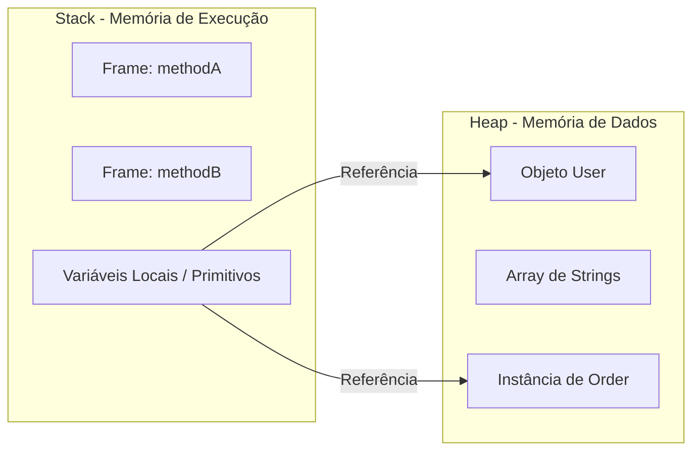

Se você já programou em Java, provavelmente ouviu que "objetos ficam no Heap e variáveis locais ficam na Stack". Mas você sabe o porquê dessa divisão e como ela impacta a performance da sua aplicação? Vamos abrir o capô da JVM e entender essa dinâmica.

## Introdução: A Organização da Memória

A JVM divide a memória de forma estratégica para equilibrar velocidade de acesso e flexibilidade. A Stack e o Heap são as duas áreas principais onde o seu código "vive" durante a execução.



## A Stack (Pilha): O Reino da Organização

A Stack é usada para a execução de threads. Cada thread tem sua própria Stack.
- **O que armazena:** Variáveis locais (primitivos e referências), frames de métodos e controle de fluxo.
- **Como funciona:** LIFO (Last-In-First-Out). Quando um método é chamado, um novo frame é empilhado. Quando termina, o frame é removido.
- **Vantagens:** Acesso ultra rápido, limpeza automática (não precisa de Garbage Collector).
- **Limitação:** Tamanho pequeno e fixo. Se você abusar (como em uma recursão infinita), terá o famoso `StackOverflowError`.

## O Heap (Monte): O Oceano de Objetos

O Heap é a área de memória compartilhada por todas as threads.
- **O que armazena:** Todos os objetos (instâncias de classes) e arrays.
- **Como funciona:** Alocação dinâmica. Os objetos vivem lá até que o Garbage Collector decida que eles não são mais necessários.
- **Vantagens:** Flexibilidade para armazenar dados de qualquer tamanho que persistam além da execução de um único método.
- **Limitação:** Acesso mais lento que a Stack e depende do Garbage Collector para limpeza, o que pode causar pausas na aplicação.

## Exemplo Visual em Código

```java
public void process() {
    int count = 10;                // Primitivo: Valor na STACK
    User user = new User("User");  // Referência 'user' na STACK, Objeto 'User' no HEAP
}
```

*Explicação:* 
1. `count` é um `int`, seu valor `10` fica direto no frame do método na Stack.
2. `user` é uma variável de referência. O endereço de memória onde o objeto `User` está fica na Stack, mas os dados reais do objeto (nome "João", etc) ficam no Heap.

## Curiosidade: Escape Analysis

As JVMs modernas são inteligentes. Se o JIT Compiler perceber que um objeto criado dentro de um método nunca "escapa" dele (ou seja, não é retornado nem passado para outras threads), ele pode decidir alocar esse objeto diretamente na **Stack**! Isso é chamado de *Scalar Replacement*, e evita o overhead do Garbage Collector.

## Conclusão

Entender a diferença entre Stack e Heap é fundamental para debugar erros (OOM vs StackOverflow) e escrever código mais eficiente. Lembre-se: Stack é sobre **execução** e Heap é sobre **dados**.