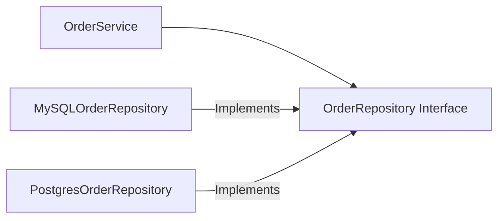

Você já sentiu aquele frio na barriga ao precisar alterar uma regra de negócio em um sistema legado? Aquele medo de que uma pequena mudança em um `Service` quebre silenciosamente um fluxo de pagamento em outra ponta do sistema? Esse caos é o sintoma clássico de um código que ignora os fundamentos da orientação a objetos.

Os princípios **SOLID**, popularizados por Robert C. Martin (Uncle Bob), são o antídoto para a "Grande Bola de Lama" (*Big Ball of Mud*). Eles não são regras rígidas, mas sim diretrizes que visam a manutenibilidade, testabilidade e extensibilidade do software.

## S - Single Responsibility Principle (SRP)

**"Uma classe deve ter um, e apenas um, motivo para mudar."**

Muitas vezes confundimos "fazer uma coisa" com "ter uma responsabilidade". Uma classe `UserService` que valida dados, salva no banco e envia e-mails de boas-vindas está violando o SRP.

### Exemplo em Java

```java
// VIOLAÇÃO: O serviço faz tudo
public class UserService {
    public void registerUser(User user) {
        if (user.getEmail().contains("@")) { // Validação
            // Salva no banco (Persistência)
            System.out.println("Salvando usuário no MySQL...");
            // Envia e-mail (Notificação)
            System.out.println("Enviando e-mail de boas-vindas...");
        }
    }
}

// ADERENTE: Responsabilidades separadas
public class UserRepository {
    public void save(User user) { /* lógica de banco */ }
}

public class EmailService {
    public void sendWelcomeEmail(User user) { /* lógica de SMTP */ }
}

public class UserRegistrationService {
    private final UserRepository repository;
    private final EmailService emailService;

    public UserRegistrationService(UserRepository repository, EmailService emailService) {
        this.repository = repository;
        this.emailService = emailService;
    }

    public void register(User user) {
        // Validação pode estar em um Validator dedicado
        repository.save(user);
        emailService.sendWelcomeEmail(user);
    }
}
```

**Benefícios:**
- **Testabilidade:** Você testa o e-mail sem precisar do banco.
- **Baixo Acoplamento:** Mudanças no banco não afetam o envio de e-mail.

**Desafios:**
- **Explosão de Classes:** O número de arquivos no projeto aumenta consideravelmente.
- **Fragmentação:** Pode ser difícil entender o fluxo completo navegando em muitos arquivos pequenos.

---

## O - Open/Closed Principle (OCP)

**"Entidades de software devem estar abertas para extensão, mas fechadas para modificação."**

Se você precisa adicionar um novo tipo de desconto e tem que abrir a classe `DiscountCalculator` para adicionar um `if` ou `switch`, você está violando o OCP.

### Exemplo em Java

```java
public interface DiscountStrategy {
    double apply(double amount);
}

public class ChristmasDiscount implements DiscountStrategy {
    public double apply(double amount) { return amount * 0.9; }
}

public class BlackFridayDiscount implements DiscountStrategy {
    public double apply(double amount) { return amount * 0.5; }
}

public class DiscountService {
    public double calculate(double amount, DiscountStrategy strategy) {
        return strategy.apply(amount);
    }
}
```

**Benefícios:**
- **Estabilidade:** Você não mexe no código que já está em produção para adicionar features.
- **Escalabilidade:** Novos comportamentos são apenas novas classes.

**Desafios:**
- **Abstração Prematura:** Criar interfaces para tudo pode tornar o código desnecessariamente complexo.
- **Dificuldade de Leitura:** O fluxo de execução salta entre múltiplas implementações.

---

## L - Liskov Substitution Principle (LSP)

**"Subtipos devem ser substituíveis por seus tipos de base sem alterar a correção do programa."**

O clássico erro do "Quadrado que herda de Retângulo" ilustra bem isso. Se uma subclasse altera o comportamento esperado da superclasse (lançando exceções inesperadas, por exemplo), ela quebra o contrato.

### Exemplo em Java

```java
// VIOLAÇÃO: Pinguim é uma ave, mas não voa.
public class Bird {
    public void fly() { System.out.println("Voando..."); }
}

public class Penguin extends Bird {
    @Override
    public void fly() { throw new UnsupportedOperationException("Pinguins não voam!"); }
}

// ADERENTE: Hierarquia baseada em comportamento
public abstract class Bird { }

public interface FlyingBird {
    void fly();
}

public class Eagle extends Bird implements FlyingBird {
    public void fly() { System.out.println("Águia voando..."); }
}

public class Penguin extends Bird {
    // Pinguim não implementa FlyingBird
}
```

**Benefícios:**
- **Confiança no Polimorfismo:** Você pode usar qualquer subclasse sem medo de efeitos colaterais.
- **Robustez:** Evita erros de tempo de execução (Runtime Exceptions) por quebra de contrato.

**Desafios:**
- **Hierarquias Complexas:** Pode gerar árvores de herança ou interfaces muito profundas.
- **Rigidez:** Exige um planejamento arquitetural muito mais detalhado no início.

---

## I - Interface Segregation Principle (ISP)

**"Clientes não devem ser forçados a depender de interfaces que não utilizam."**

Interfaces "gordas" forçam classes a implementar métodos inúteis, gerando acoplamento desnecessário.

### Exemplo em Java

```java
// VIOLAÇÃO: Interface genérica demais
public interface SmartDevice {
    void print();
    void fax();
    void scan();
}

// ADERENTE: Interfaces segregadas por funcionalidade
public interface Printer { void print(); }
public interface Scanner { void scan(); }
public interface Fax { void fax(); }

public class SimplePrinter implements Printer {
    public void print() { System.out.println("Imprimindo..."); }
}

public class AllInOneDevice implements Printer, Scanner, Fax {
    public void print() { /*...*/ }
    public void scan() { /*...*/ }
    public void fax() { /*...*/ }
}
```

**Benefícios:**
- **Desacoplamento:** Mudar o contrato de `Fax` não afeta quem só usa `Printer`.
- **Clareza de Intenção:** O contrato da classe diz exatamente o que ela faz.

**Desafios:**
- **Gerenciamento de Interfaces:** Mais arquivos e tipos para manter no ecossistema.
- **Boilerplate:** Pode exigir mais código para compor comportamentos.

---

## D - Dependency Inversion Principle (DIP)

**"Dependa de abstrações, não de implementações concretas."**

Este é o coração da Injeção de Dependência. O módulo de alto nível (sua regra de negócio) não deve conhecer os detalhes do módulo de baixo nível (como o banco de dados).

### Exemplo em Java



```java
// ADERENTE: Dependendo da abstração
public interface OrderRepository {
    void save(Order order);
}

public class OrderService {
    private final OrderRepository repository; // Depende da Interface

    public OrderService(OrderRepository repository) {
        this.repository = repository;
    }

    public void processOrder(Order order) {
        repository.save(order);
    }
}
```

**Benefícios:**
- **Plugabilidade:** Trocar o MySQL pelo PostgreSQL vira uma configuração de Spring, não uma refatoração.
- **Mockabilidade:** Testes unitários tornam-se triviais com o uso de Mocks/Stubs.

**Desafios:**
- **Indireção:** Pode ser difícil encontrar a implementação real em tempo de execução sem ferramentas de IDE.
- **Curva de Aprendizado:** Exige compreensão profunda de frameworks de DI (Spring, Micronaut).

## O "Custo" da Qualidade

Implementar SOLID não é gratuito. O custo inicial de desenvolvimento aumenta porque você escreve mais interfaces, mais classes e pensa mais na arquitetura. No entanto, o **Total Cost of Ownership (TCO)** cai drasticamente após os primeiros meses de projeto.

Um sistema SOLID é como um conjunto de peças de LEGO: fácil de montar, desmontar e substituir. Um sistema sem SOLID é como uma escultura de argila: uma vez seca, qualquer tentativa de mudança pode rachar a estrutura inteira.

{: .prompt-tip }
> **Dica:** Não tentar aplicar todos os princípios de uma vez em um código que não entende. Comece pelo SRP e DIP, eles costumam trazer 80% dos benefícios com 20% do esforço.

