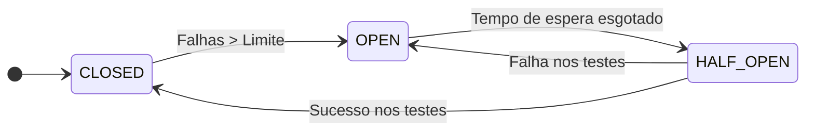

Em uma arquitetura de microserviços, as falhas são inevitáveis. Uma API lenta ou um banco de dados fora do ar podem gerar um efeito dominó que derruba todo o seu ecossistema. O **Circuit Breaker** (Disjuntor) é a proteção que evita que uma pequena falha se torne um desastre total.

## O Gancho: A Analogia do Disjuntor Elétrico

Na sua casa, o disjuntor desarma quando há uma sobrecarga, protegendo os seus aparelhos. No software, o Circuit Breaker interrompe chamadas a um serviço que está falhando, protegendo o seu sistema de ficar travado esperando respostas que não virão.




## Os 3 Estados do Disjuntor

1.  **Closed (Fechado):** O sistema está saudável. As requisições passam normalmente. O disjuntor fica monitorando a taxa de erros.
2.  **Open (Aberto):** O limite de erros foi atingido. O disjuntor "abre" e **bloqueia imediatamente** todas as chamadas. Ele retorna um erro rápido ou um valor padrão (fallback) sem nem tentar chamar o serviço instável.
3.  **Half-Open (Meio Aberto):** Após um tempo de espera, o disjuntor deixa passar algumas requisições de teste para ver se o serviço voltou ao normal. Se funcionar, ele fecha; se falhar, ele abre novamente.

## Exemplo Prático com Resilience4j (Spring Boot)

```java
@CircuitBreaker(name = "paymentService", fallbackMethod = "fallbackPayment")
public PaymentResponse process(PaymentRequest request) {
    return restTemplate.postForObject("/payments", request, PaymentResponse.class);
}

// O que acontece se o serviço de pagamentos estiver fora do ar
public PaymentResponse fallbackPayment(PaymentRequest request, Throwable t) {
    return new PaymentResponse("PENDING", "Sistema temporariamente indisponível. Tente mais tarde.");
}
```

## Por que usar?

1.  **Liberação de Recursos:** Evita que suas threads fiquem presas esperando timeouts longos.
2.  **User Experience:** É melhor retornar um erro rápido ou um dado em cache do que deixar o usuário vendo um "loading" infinito.
3.  **Recuperação do Serviço Falho:** Ao parar de enviar requisições, você dá fôlego para o serviço que está sofrendo se recuperar (ex: reduzir carga de CPU).

## Dica: Bulkhead

Combine o Circuit Breaker com o padrão **Bulkhead**. Enquanto o disjuntor para as chamadas, o Bulkhead isola os pools de threads para que a falha em um serviço de "E-mail" não consuma todas as threads do serviço de "Checkout".

## Conclusão

Circuit Breaker não é opcional em sistemas distribuídos modernos. Ele é a diferença entre um sistema que "manca" mas continua vivo e um sistema que sofre uma parada total por causa de uma dependência instável.