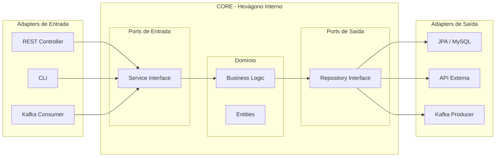

Você já sentiu que seu código está "preso" ao framework? Que trocar o Spring pelo Micronaut ou o MySQL pelo DynamoDB seria um pesadelo? A **Arquitetura Hexagonal (ou Ports & Adapters)** resolve isso separando o que é "negócio" do que é "ferramenta".

## O Gancho: O Core é Sagrado

Na Arquitetura Hexagonal, o centro (Core) contém as regras de negócio puras. Ele não sabe o que é um Banco de Dados, o que é um Controller REST ou o que é o Kafka. Ele apenas expõe e consome interfaces (**Ports**).




## A Estrutura de Pastas Sugerida

Para um projeto Java/Kotlin, uma estrutura robusta seria:

```text
src/main/java/com/company/benefit
├── domain/             <-- O Coração (Hexágono Interno)
│   ├── model/          <-- Entidades puras (Account, Balance)
│   ├── service/        <-- Lógica de negócio (UseCase)
│   └── repository/     <-- Interfaces (Output Ports)
├── application/        <-- Orquestração
│   └── dto/            <-- Objetos de entrada/saída da API
└── infrastructure/     <-- O Mundo Externo (Adapters)
    ├── adapters/
    │   ├── db/         <-- Implementações JPA/NoSQL
    │   ├── web/        <-- Controllers REST
    │   └── messaging/  <-- Consumidores Kafka/Rabbit
    └── config/         <-- Configurações de Beans do Framework
```

## Os Componentes Chave

1.  **Domain:** Contém a inteligência. Não deve ter dependências de infraestrutura (nada de `@Entity` do Hibernate aqui, se você for um purista).
2.  **Ports (Interfaces):** Definem o contrato. "Eu preciso de alguém que salve uma conta".
3.  **Adapters (Implementações):** São os "plugs". O `JpaAccountRepository` é um adaptador que se encaixa no port `AccountRepository`.

## Exemplo de Inversão de Dependência

O segredo está em quem conhece quem:
- O **Adapter** conhece o **Port**.
- O **Service** conhece o **Port**.
- **Ninguém do Core conhece o Adapter.**

```java
// infrastructure.adapters.db
@Component
public class JpaAccountAdapter implements AccountRepository { // Implementa o PORT
    private final JpaRepo jpa;
    public void save(Account a) { ... }
}
```

## Vantagens Reais

1.  **Testabilidade:** Você testa o `domain.service` usando apenas Mocks das interfaces, sem subir banco ou contexto de framework.
2.  **Longevidade:** O framework pode evoluir ou mudar, mas as regras de negócio (ex: como calcular benefícios) continuam intactas no Core.
3.  **Foco:** O desenvolvedor foca no problema de negócio antes de se preocupar com a tabela do banco.

## Conclusão

Estruturar pastas não é apenas estética, é design de software. A Arquitetura Hexagonal traz clareza sobre onde cada coisa deve morar e protege o seu ativo mais valioso: a lógica de negócio.