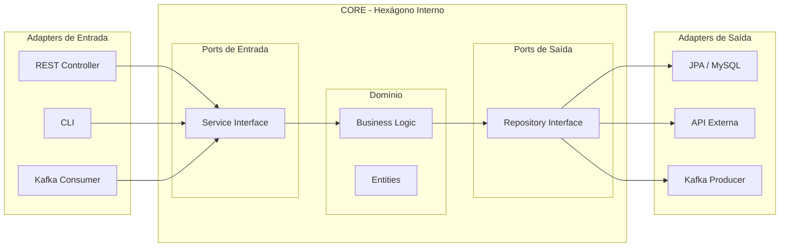

Você já sentiu que seu código está "preso" ao framework? Que trocar o Spring pelo Micronaut ou o MySQL pelo DynamoDB seria um pesadelo? A **Arquitetura Hexagonal (ou Ports & Adapters)** resolve isso separando o que é "negócio" do que é "ferramenta".

## O Core é Sagrado

Na Arquitetura Hexagonal, o centro (Core) contém as regras de negócio puras. Ele não sabe o que é um Banco de Dados, o que é um Controller REST ou o que é o Kafka. Ele apenas expõe e consome interfaces (**Ports**).



---

## Context Mapping e Limites

Precisamos entender onde o hexágono termina. No DDD (Domain-Driven Design), usamos o **Context Mapping** para desenhar essas fronteiras.

- **Bounded Context:** Cada hexágono deve representar um contexto delimitado (ex: Pedidos, Pagamentos). Tentar colocar tudo em um só "super-hexágono" é o caminho para um monolito distribuído.
- **Shared Kernel:** Quando dois contextos compartilham o mesmo modelo (ex: a entidade `User` é a mesma para todos). Use com cautela extrema.
- **Customer-Supplier:** Uma relação clara de dependência onde o "Supplier" fornece dados para o "Customer".

## Anti-Corruption Layer (ACL)

Quando seu hexágono precisa falar com um sistema legado "sujo" ou uma API de terceiros com um modelo de dados confuso, você usa uma **Anti-Corruption Layer (ACL)**.

A ACL é um Adapter de Saída especializado que não apenas traduz protocolos, mas **traduz semântica**. 
- O Legacy Service chama o campo de `customer_id` de `id_001_v3`.
- Sua ACL recebe isso e converte para o seu objeto de domínio `CustomerId`.
- **Objetivo:** Impedir que o "caos" do sistema externo vaze para dentro do seu Core puro.

---

## A Estrutura de Pastas Sugerida

Para um projeto Java/Kotlin, uma estrutura robusta seria:

```text
src/main/java/com/company/benefit
├── domain/             <-- O Coração (Hexágono Interno)
│   ├── model/          <-- Entidades puras (Account, Balance)
│   ├── service/        <-- Lógica de negócio (UseCase)
│   └── repository/     <-- Interfaces (Output Ports)
├── application/        <-- Orquestração
│   └── dto/            <-- Objetos de entrada/saída da API
└── infrastructure/     <-- O Mundo Externo (Adapters)
    ├── adapters/
    │   ├── db/         <-- Implementações JPA/NoSQL
    │   ├── web/        <-- Controllers REST
    │   ├── external/   <-- ACLs para sistemas externos
    │   └── messaging/  <-- Consumidores Kafka/Rabbit
    └── config/         <-- Configurações de Beans do Framework
```

## Os Componentes Chave

1.  **Domain:** Contém a inteligência. Não deve ter dependências de infraestrutura (nada de `@Entity` do Hibernate aqui, se você for um purista).
2.  **Ports (Interfaces):** Definem o contrato. "Eu preciso de alguém que salve uma conta".
3.  **Adapters (Implementações):** São os "plugs". O `JpaAccountRepository` é um adaptador que se encaixa no port `AccountRepository`.

## Exemplo de Inversão de Dependência

O segredo está em quem conhece quem:
- O **Adapter** conhece o **Port**.
- O **Service** conhece o **Port**.
- **Ninguém do Core conhece o Adapter.**

```java
// infrastructure.adapters.db
@Component
public class JpaAccountAdapter implements AccountRepository { // Implementa o PORT
    private final JpaRepo jpa;
    public void save(Account a) { ... }
}
```

## Vantagens Reais

1.  **Testabilidade:** Você testa o `domain.service` usando apenas Mocks das interfaces, sem subir banco ou contexto de framework.
2.  **Longevidade:** O framework pode evoluir ou mudar, mas as regras de negócio (ex: como calcular benefícios) continuam intactas no Core.
3.  **Foco:** O desenvolvedor foca no problema de negócio antes de se preocupar com a tabela do banco.

## Insight Final: O Hexágono como Proteção de Investimento

A Arquitetura Hexagonal não é sobre criar mais pastas ou interfaces, é sobre proteger o seu investimento intelectual. Frameworks, bancos de dados e protocolos de comunicação são tecnologias transitórias que mudam a cada 5 ou 10 anos. Já as regras de negócio do seu domínio são o que realmente gera valor. Ao isolar o "Core" do mundo externo, você garante que sua aplicação possa evoluir tecnologicamente sem precisar ser reescrita do zero a cada mudança de tendência do mercado.