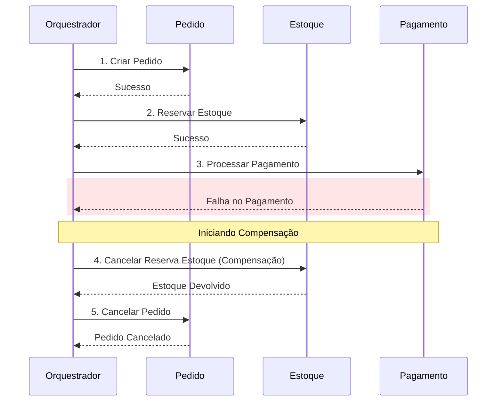

Em um monólito, se você precisa salvar um pedido e baixar o estoque, você usa uma transação `@Transactional` e o banco garante o ACID. Mas e se o Pedido estiver no Microserviço A e o Estoque no Microserviço B? Como garantir que os dois aconteçam ou os dois falhem? O **Saga Pattern** é a resposta.

## O Fim das Transações Distribuídas (2PC)

Antigamente usávamos transações distribuídas (Two-Phase Commit), mas elas são lentas e não escalam bem na nuvem. O Saga resolve isso usando uma sequência de **transações locais** e **mensageria**.

## Como funciona a Saga

Uma Saga é uma sequência de transações locais. Cada transação atualiza o banco e dispara um evento para a próxima etapa. Se uma etapa falhar, a Saga deve executar **Transações de Compensação** (Undo) para desfazer o que foi feito nas etapas anteriores.

## Os Dois Tipos de Sagas

1.  **Coreografia:** Não há um "mestre". Cada serviço sabe o que fazer quando recebe um evento. (Ex: "Estoque reservado" -> "Processar Pagamento"). É fácil de começar, mas difícil de visualizar em fluxos complexos.
2.  **Orquestração:** Existe um serviço central (Orquestrador) que diz a todos o que fazer. Se o pagamento falhar, o Orquestrador manda o comando "Estornar Estoque" para o serviço correspondente. É mais fácil de debugar e monitorar.

## Exemplo de Fluxo de Compensação

1.  Serviço de Pedido: Cria pedido (PENDING).
2.  Serviço de Estoque: Reserva item (OK).
3.  Serviço de Pagamento: Processa (FALHA).
4.  **Compensação:** Serviço de Estoque recebe evento de falha e devolve o item (CANCELADO).
5.  **Compensação:** Serviço de Pedido marca como (ERRO).

## Por que é difícil?

Diferente do banco de dados, o Saga não garante o "I" (Isolamento) do ACID. Um usuário pode ver um pedido como "Criado" antes mesmo do estoque ser confirmado. Seu sistema precisa estar preparado para lidar com essa "Consistência Eventual".

## Checklist de Design de Sagas

Ao projetar uma transação distribuída baseada em Sagas, valide estes pontos críticos:
- [ ] Cada etapa da Saga possui uma **Transação de Compensação** (Undo) correspondente?
- [ ] As transações de compensação são **Idempotentes**? (Elas podem ser chamadas várias vezes sem erro).
- [ ] O sistema tolera **Consistência Eventual**? (O usuário pode ver um estado intermediário).
- [ ] Existe um **Timeout** claro para cada etapa para disparar a compensação automaticamente?
- [ ] Em caso de Orquestração: O Orquestrador é persistente e capaz de retomar de onde parou após um crash?