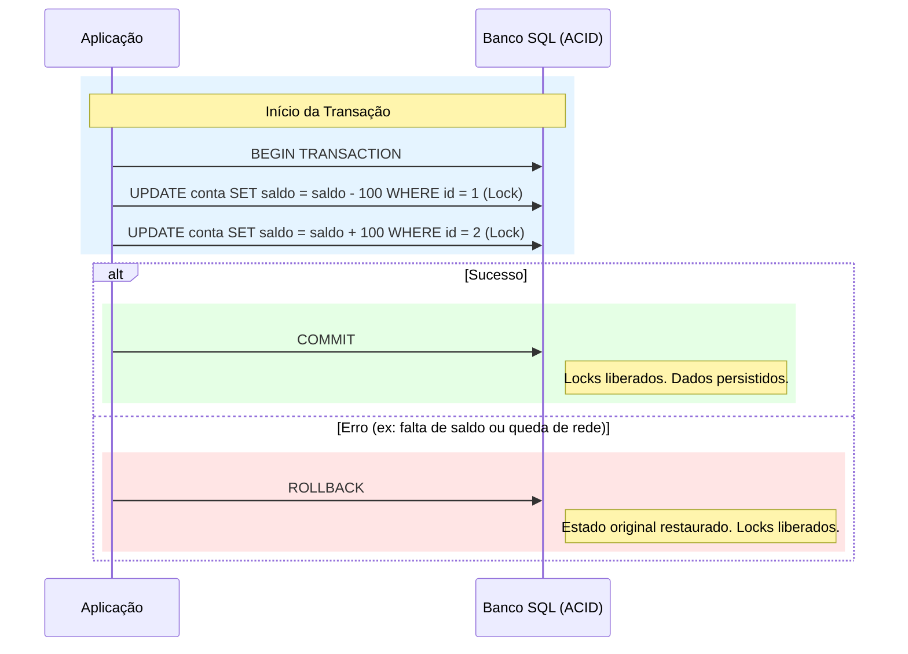
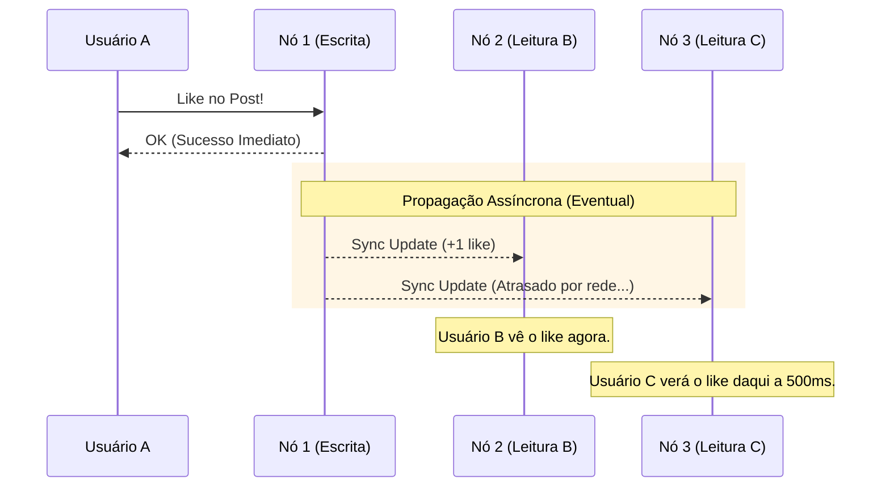

Quando projetamos sistemas, uma das decisões mais críticas é: **o quão "certo" o dado precisa estar em um determinado momento?** Para responder a isso, existem dois modelos mentais opostos de consistência: o tradicional **ACID** (dos bancos relacionais) e o moderno **BASE** (dos bancos NoSQL de alta escala).

## O Conflito: Certeza vs Disponibilidade

Em um sistema bancário, se você transfere R$ 100,00, o saldo deve ser subtraído de uma conta e adicionado à outra no mesmo instante. Se algo falhar no meio, nada deve acontecer. Esse é o mundo **ACID**.

Já em uma rede social, se você posta uma foto, não importa se o seu amigo em Tóquio a veja 2 segundos depois de você. O importante é que o sistema nunca pare de aceitar novos posts. Esse é o mundo **BASE**.

---

## 1. ACID: O Rigor da Transação (Padrão SQL)

O acrônimo ACID define as propriedades que garantem que as transações do banco de dados sejam processadas de forma confiável.

- **Atomicity (Atomicidade):** A operação é "tudo ou nada". Se uma parte falha, toda a transação sofre rollback.
- **Consistency (Consistência):** O banco garante que o dado saia de um estado válido para outro estado válido, respeitando todas as `constraints` (Unique, Foreign Keys, etc).
- **Isolation (Isolamento):** Transações simultâneas não interferem umas nas outras. O resultado deve ser o mesmo que se fossem executadas sequencialmente.
- **Durability (Durabilidade):** Uma vez confirmada (commit), a alteração é permanente, mesmo em caso de queda de energia ou falha do servidor.

### Exemplo de Fluxo ACID (Transferência Bancária)

No diagrama abaixo, vemos como o banco bloqueia os recursos (Locks) para garantir o isolamento:

**Ideal para:** Sistemas financeiros, ERPs, controle de estoque e qualquer cenário onde a inconsistência temporária signifique prejuízo direto.

---

## 2. BASE: A Fluidez da Escala (Padrão NoSQL)

O modelo BASE surgiu para lidar com sistemas que precisam escalar para milhões de usuários globais, onde o custo de manter "Locks" e sincronia absoluta (ACID) tornaria o sistema lento ou indisponível.

- **Basically Available (Basicamente Disponível):** O sistema prioriza responder às requisições, mesmo que alguns nós estejam fora ou com dados antigos.
- **Soft State (Estado Suave):** O estado do sistema pode mudar ao longo do tempo, mesmo sem novas entradas, devido à propagação interna de dados entre réplicas.
- **Eventual Consistency (Consistência Eventual):** O sistema garante que, se não houver novas atualizações, eventualmente todos os nós terão o mesmo dado. O "atraso" pode ser de milissegundos ou alguns segundos.

### Exemplo de Fluxo BASE (Contador de Likes)

No modelo BASE, a escrita é rápida em um nó e a sincronia acontece em "background":

**Ideal para:** Redes sociais, catálogos de produtos, logs de auditoria massivos e sistemas de recomendação.

---

## Comparação Direta: ACID vs BASE

| Recurso | ACID (SQL) | BASE (NoSQL) |
| :--- | :--- | :--- |
| **Prioridade** | Consistência e Integridade | Disponibilidade e Performance |
| **Escala** | Vertical (Satura rápido) | Horizontal (Escala quase infinito) |
| **Estado** | Síncrono e Firme | Assíncrono e Variável |
| **Isolamento** | Alto (Locks) | Baixo (Otimista) |
| **Complexidade** | Simples no Banco, Complexo na Escala | Complexo na Lógica de Negócio |

---

## Onde entra o Teorema CAP?

O modelo **ACID** geralmente foca em ser **CP** (Consistência e Tolerância a Partição), sacrificando a Disponibilidade se a rede falhar. 

Já o modelo **BASE** foca em ser **AP** (Disponibilidade e Tolerância a Partição), aceitando que os dados fiquem inconsistentes por um breve período para garantir que o usuário nunca receba um erro de "Servidor Indisponível".

*(Para saber mais sobre isso, confira nosso post sobre Teorema CAP).*

## Takeaway Prático: ACID para Dinheiro, BASE para Engajamento

Para simplificar sua decisão arquitetural, aplique esta regra: se uma inconsistência de dados pode gerar um processo jurídico ou prejuízo financeiro direto, utilize **ACID** (Bancos Relacionais). Se a escala global e a experiência do usuário sem interrupções são os motores do seu crescimento, abrace a Consistência Eventual do modelo **BASE** (NoSQL). Lembre-se que você não precisa escolher apenas um; sistemas modernos de sucesso são poliglotas e utilizam o melhor de cada mundo para diferentes partes do domínio.
