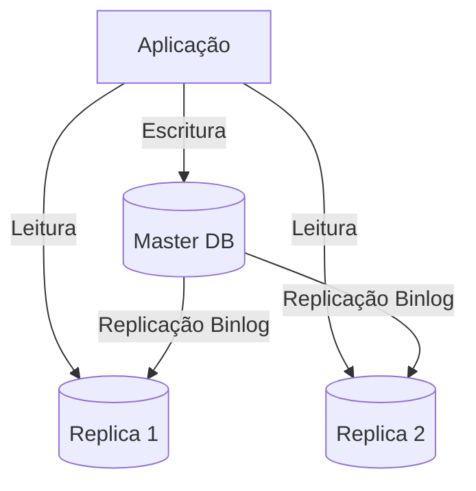
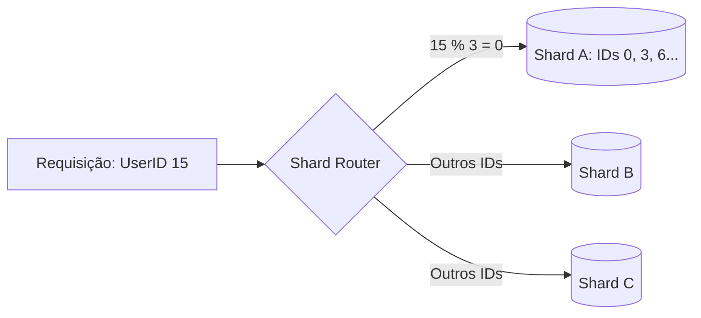

Toda aplicação de sucesso chega a um ponto crítico: o banco de dados se torna o gargalo. Quando o tempo de resposta sobe e o uso de CPU atinge 90%, você sabe que a arquitetura atual não aguenta mais. Mas escalar um banco de dados não é apenas "comprar um servidor maior". Existem estratégias distintas para diferentes tipos de carga (leitura vs. escrita).

## O Limite da Centralização

Em um sistema monolítico clássico, o banco de dados é o ponto único de verdade (e de falha). À medida que as conexões aumentam, o *locking* de tabelas e a contenção de I/O começam a degradar a performance.

---

## 1. Escalonamento Vertical (Scale Up)

A abordagem mais simples: aumentar os recursos do servidor atual (CPU, RAM, NVMe).

- **Vantagem:** Zero alteração no código. É puramente operacional.
- **Desvantagem:** Existe um "teto de vidro" físico e financeiro. Além disso, você ainda tem um **Single Point of Failure**.

---

## 2. Escalonamento Horizontal: Replicação de Leitura

Se o seu sistema é *read-heavy* (como um blog ou e-commerce), a primeira estratégia é separar leituras de escritas.



### Funcionamento Interno
O nó **Primary (Master)** recebe os comandos `INSERT/UPDATE/DELETE`. Ele grava essas alterações em um log binário (*binlog*). As **Réplicas** consomem esse log e aplicam as mudanças localmente. 

> **Curiosidade Técnica:** A replicação geralmente é **assíncrona**. Isso significa que existe um pequeno *lag* (milissegundos) entre a escrita no Master e a disponibilidade na Réplica. Se sua aplicação precisa de "consistência forte" logo após um post, você deve ler do Master.
{: .prompt-info }

---

## 3. Database Sharding (Fragmentação)

Quando o volume de dados é tão grande que não cabe em um único disco, ou quando a taxa de escrita explode, usamos o **Sharding**. Aqui, dividimos os dados horizontalmente entre diferentes instâncias.



### Exemplo de Sharding por `user_id`:
Imagine que você divide seus usuários em 3 shards:
- **Shard A:** IDs 1 a 1.000.000
- **Shard B:** IDs 1.000.001 a 2.000.000
- **Shard C:** IDs 2.000.001 a 3.000.000

```sql
-- No código da aplicação (ou Proxy de DB)
function getShard(userId) {
    return userId % 3; // Logica simples de roteamento
}
```

### O Pesadelo do Rebalancing
O Sharding traz uma complexidade absurda, e o **Rebalancing** (redistribuição de dados) é o seu maior vilão:
1. **Downtime ou Read-Only:** Frequentemente, você precisa travar as escritas nos shards afetados para garantir que nenhum dado seja perdido durante a migração para o novo nó.
2. **Consistência em Trânsito:** Se um registro é movido do Shard A para o Shard D, a aplicação precisa saber exatamente o milissegundo em que o roteamento deve mudar. Se o router mudar antes do dado chegar ao destino, temos um "registro fantasma".
3. **Pressão de I/O e Rede:** Mover Terabytes de dados entre servidores consome banda e disco, degradando a performance de quem ainda está usando o sistema em produção. É uma cirurgia de coração aberto com o paciente correndo uma maratona.
4. **Joins entre Shards:** Basicamente impossível de fazer de forma performática sem um middleware complexo (como Vitess ou Citus).

---

## 4. CQRS e Cache: Escalando fora do Banco Principal

Muitas vezes, a solução não é escalar o banco, mas sim tirar a carga dele.

- **Caching (Redis/Memcached):** Salvar resultados de queries custosas na memória. Se o dado não muda a cada segundo, ele não deveria estar sendo buscado no disco.
- **CQRS (Command Query Responsibility Segregation):** Separar totalmente o modelo de escrita do modelo de leitura. As leituras podem ser feitas em um banco otimizado para busca (Elasticsearch) ou um banco de documentos (**MongoDB**).

### CQRS: Sincronização e Consistência Eventual
O maior desafio do CQRS é manter o modelo de leitura sincronizado com a escrita. 
1. **Sincronização por Eventos:** Toda vez que um dado é salvo no SQL, um evento é disparado para um broker (Kafka). Um consumidor lê esse evento e atualiza o MongoDB.
2. **Consistência Eventual:** Como o processo é assíncrono, existe um intervalo onde o usuário salva o dado mas não o vê na busca imediata. Isso exige que a UI seja resiliente (ex: mostrar um estado de "processando").

### MongoDB Tuning em Alta Escala
Se o seu modelo de leitura usa MongoDB, a performance depende de dois pilares:
- **Índices Compostos:** Se você busca por `{ lojaId: 1, status: 'ATIVO' }`, um índice apenas em `lojaId` não é suficiente. Use índices compostos para cobrir seus padrões de consulta mais comuns.
- **Aggregation Framework:** Evite trazer milhares de documentos para o backend para processar. Use `$facet` para paginação e metadados em uma única chamada, ou `$lookup` (com cautela) para joins entre coleções.

---

## 5. Particionamento Vertical vs. Horizontal

Não confunda Sharding com Particionamento (nativo de bancos como PostgreSQL ou MySQL):

- **Particionamento Vertical:** Separar colunas de uma tabela em tabelas diferentes (ex: mover colunas de `BLOB` para uma tabela separada de metadados).
- **Particionamento Horizontal:** Manter a mesma estrutura de colunas, mas dividir as linhas em diferentes "arquivos" físicos dentro do mesmo banco (geralmente por data).

---

## Aplicações Práticas: Quando usar o quê?

1. **Aplicação Crescente:** Comece com **Scale Up** até onde o custo fizer sentido.
2. **E-commerce/Rede Social:** Implemente **Read Replicas** imediatamente. Cache (Redis/Memcached) é obrigatório antes de tocar no banco.
3. **Big Data / Finanças em Escala:** **Sharding** ou uso de bancos de dados nativamente distribuídos (NewSQL) como **CockroachDB** ou **TiDB**.

---

## Mini Checklist de Escalabilidade

Antes de decidir sua estratégia, valide estes pontos:

- [ ] **Monitoramento:** Você sabe se o gargalo é CPU, Memória ou I/O de disco?
- [ ] **Query Tuning:** Seus índices estão corretos? Uma query sem índice derruba qualquer cluster.
- [ ] **Connection Pooling:** Você está usando HikariCP ou pgBouncer para não estourar o limite de conexões?
- [ ] **Cache:** O dado realmente precisa vir do banco toda vez?
- [ ] **Consistência:** Sua aplicação suporta consistência eventual (lag de replicação)?

Escalar é uma jornada de compromissos (*trade-offs*). Escolha a técnica que resolve seu problema hoje, sem criar uma complexidade que seu time não possa manter amanhã.
