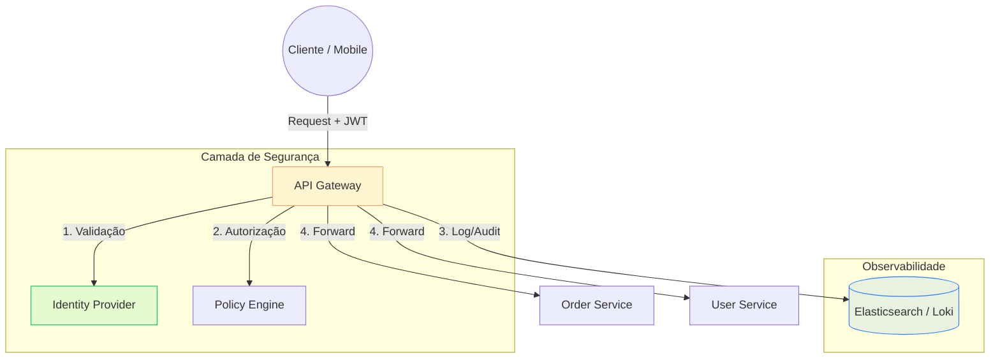

Em uma arquitetura de microserviços, a pergunta de "quem pode acessar o quê" deixa de ser uma simples checagem de sessão e se torna um desafio de escala. Se cada um dos seus 50 serviços precisar implementar validação de JWT, renovação de certificados e logs de auditoria, você não tem uma arquitetura—você tem um pesadelo de manutenção. O **API Gateway** surge como a camada de abstração necessária para centralizar essas preocupações transversais (*cross-cutting concerns*).

## A Fragmentação da Lógica Transversal

Quando distribuímos o sistema, a segurança e a visibilidade tendem a se diluir. Sem um ponto central, você acaba com diferentes implementações de segurança, logs em formatos inconsistentes e uma dificuldade hercúlea para rastrear uma requisição que cruza múltiplos domínios.

O Gateway atua como o **Ponto Único de Entrada**, protegendo o tráfego interno e garantindo que apenas requisições legítimas cheguem aos seus serviços de backend.



---

## 1. Autenticação e Autorização Centralizadas

Em vez de cada serviço descriptografar o token JWT e validar a assinatura com a chave pública, o Gateway faz isso na borda. Ele valida o emissor (`iss`), a expiração (`exp`) e as permissões (`scopes`). Se o token for inválido, a requisição é rejeitada antes mesmo de consumir recursos da sua rede interna.

### Exemplo Completo: Configuração Declarativa do Kong

O **Kong** é um dos gateways mais populares, baseado no Nginx. Abaixo, temos um arquivo de configuração declarativa funcional que implementa autenticação JWT e limite de taxa (*rate limiting*).

```yaml
# file: kong.yml
_format_version: "3.0"
_transform: true

services:
  - name: order-service
    url: http://order-svc.internal:8080
    routes:
      - name: order-route
        paths:
          - /orders
        methods:
          - GET
          - POST
    plugins:
      # Ativa a autenticação JWT para esta rota específica
      - name: jwt
        config:
          header_names:
            - Authorization
          uri_param_names:
            - jwt
          key_claim_name: iss
          secret_is_base64: false

      # Implementa Rate Limiting para evitar abusos
      - name: rate-limiting
        config:
          second: 5
          hour: 10000
          policy: local

consumers:
  - username: frontend-app
    jwt_secrets:
      - key: "https://auth.meusistema.com" # O 'iss' esperado no JWT
        secret: "minha-chave-secreta-compartilhada"
```

---

## 2. Logs e Auditoria: O Rastro Digital

O Gateway é o lugar perfeito para gerar logs de auditoria imutáveis. Como todas as requisições passam por ele, podemos capturar metadados essenciais sem poluir o código de negócio:
- `X-Correlation-ID`: Identificador único para rastrear a requisição em todos os serviços.
- `User-Agent` e `IP de Origem`.
- Latência de resposta do backend.
- Status Code retornado.

### Implementação com Spring Cloud Gateway (Java)

Se você prefere uma solução programática no ecossistema Spring, veja como configurar um filtro global de log e auditoria:

```java
// file: LoggingFilter.java
package com.techblog.gateway.filters;

import org.slf4j.Logger;
import org.slf4j.LoggerFactory;
import org.springframework.cloud.gateway.filter.GatewayFilterChain;
import org.springframework.cloud.gateway.filter.GlobalFilter;
import org.springframework.core.Ordered;
import org.springframework.stereotype.Component;
import org.springframework.web.server.ServerWebExchange;
import reactor.core.publisher.Mono;

import java.util.UUID;

@Component
public class LoggingFilter implements GlobalFilter, Ordered {

    private static final Logger logger = LoggerFactory.getLogger(LoggingFilter.class);

    @Override
    public Mono<Void> filter(ServerWebExchange exchange, GatewayFilterChain chain) {
        // 1. Gera ou recupera o Correlation ID
        String correlationId = UUID.randomUUID().toString();
        exchange.getRequest().mutate()
                .header("X-Correlation-ID", correlationId)
                .build();

        long startTime = System.currentTimeMillis();
        String path = exchange.getRequest().getPath().toString();
        String method = exchange.getRequest().getMethod().name();

        return chain.filter(exchange).then(Mono.fromRunnable(() -> {
            long duration = System.currentTimeMillis() - startTime;
            int statusCode = exchange.getResponse().getStatusCode().value();

            // 2. Log de Auditoria Centralizado
            logger.info("Audit: Method={}, Path={}, Status={}, Duration={}ms, TraceId={}",
                    method, path, statusCode, duration, correlationId);
        }));
    }

    @Override
    public int getOrder() {
        // Garante que este filtro rode antes de todos os outros
        return Ordered.HIGHEST_PRECEDENCE;
    }
}
```

---

## Tradeoffs: O Custo da Centralização

Introduzir um API Gateway não é apenas ganhar funcionalidades; é assumir novas responsabilidades:

1.  **Ponto Único de Falha (SPOF):** Se o Gateway cai, toda a sua API cai. Ele precisa ser altamente disponível (multi-AZ) e resiliente.
2.  **Latência Adicional:** Cada requisição ganha alguns milissegundos extras devido ao processamento de plugins (Auth, Logs, Transmutação).
3.  **Complexidade de Configuração:** Regras de roteamento complexas podem se tornar difíceis de depurar sem as ferramentas certas.
4.  **Gargalo de Performance:** Como todo o tráfego funila por ele, o Gateway precisa de CPU e Memória generosos, além de tunning de conexões TCP.

---

## Alternativas ao API Gateway

Existem cenários onde o Gateway pode ser "demais":

-   **BFF (Backend For Frontend):** Em vez de um Gateway genérico, você cria um pequeno serviço para cada tipo de cliente (Web, Mobile). Isso permite que o BFF agregue chamadas de múltiplos serviços de forma específica para a UI.
-   **Service Mesh (Istio):** Se o seu foco é comunicação *inter-serviços* (Leste-Oeste) e não apenas entrada (Norte-Sul), um Service Mesh pode lidar com Auth e Logs via Sidecars, eliminando o Gateway central.
-   **Shared Libraries:** O método antigo. Você cria uma biblioteca (ex: uma JAR) que todos os serviços importam para validar tokens. É perigoso, pois forçar uma atualização de segurança exige o redeploy de todos os serviços.

---

## Conclusão: Insight Final

O API Gateway não é apenas um roteador; é o cérebro da sua borda. Ele permite que seus desenvolvedores de backend foquem 100% na regra de negócio, enquanto a infraestrutura garante que ninguém entre sem convite e que cada passo seja devidamente registrado. Se você está escalando para mais de 3 microserviços, o investimento em um Gateway (seja Kong, Tyk ou AWS API Gateway) deixará de ser um luxo e se tornará o alicerce da sua governança.
