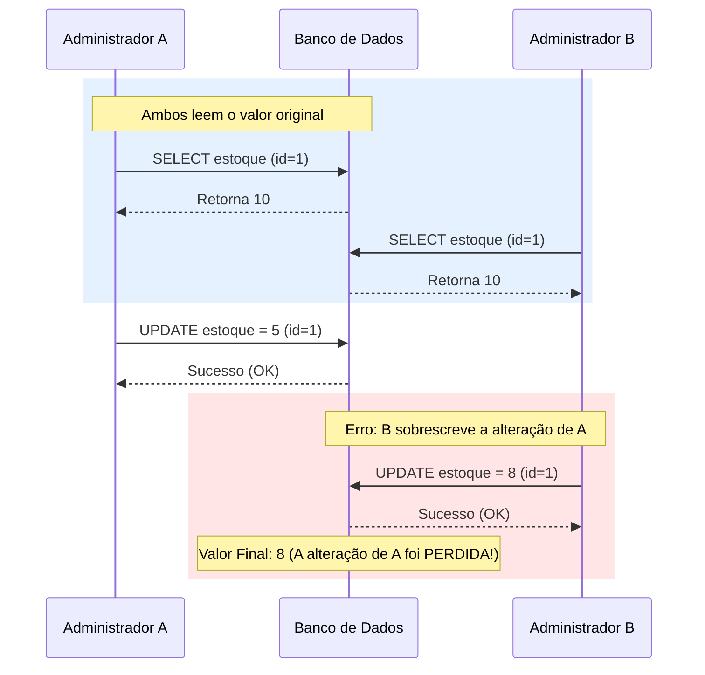

Imagine o seguinte cenário: dois administradores de um e-commerce abrem a mesma página de produto ao mesmo tempo para atualizar o estoque. 
- O administrador A vê que há 10 unidades e decide mudar para 5.
- O administrador B, no mesmo segundo, decide mudar para 8.

Se o sistema não tiver um controle de concorrência, o último que clicar em "Salvar" vai sobrescrever a alteração do outro, gerando o famoso problema da **Atualização Perdida (Lost Update)**. Para resolver isso, existem duas estratégias fundamentais: **Lock Otimista** e **Lock Pessimista**.

## O Problema: Condição de Corrida (Race Condition)

Em sistemas distribuídos e multi-thread, a consistência dos dados é constantemente ameaçada quando múltiplos processos tentam ler e escrever no mesmo registro simultaneamente. O bloqueio (locking) é o mecanismo que garante que a integridade seja mantida.

Abaixo, vemos como a falta de controle resulta na perda de dados:



---

## 1. Lock Pessimista: "Não toque, é meu"

O Lock Pessimista assume o pior cenário: ele acredita que a colisão **vai acontecer**. Por isso, ele bloqueia o registro no momento da leitura, impedindo que qualquer outro processo o altere até que a transação atual termine.

### Como aplicar no SQL:
O comando mais comum é o `SELECT ... FOR UPDATE`.

```sql
-- Inicia a transação
BEGIN;

-- Bloqueia a linha para outros escritores
SELECT * FROM produtos WHERE id = 1 FOR UPDATE;

-- Realiza a atualização
UPDATE produtos SET estoque = 5 WHERE id = 1;

-- Libera o lock
COMMIT;
```

### Quando usar?
- Alta taxa de colisão (muitas pessoas editando o mesmo dado ao mesmo tempo).
- Operações críticas onde o custo de uma falha é muito alto (ex: reserva de assento em avião).

> **Atenção:** O Lock Pessimista pode causar quedas de performance e até **Deadlocks** se não for usado com cautela, pois mantém conexões de banco presas por mais tempo.
{: .prompt-warning }

---

## 2. Lock Otimista: "Espero que ninguém tenha mexido"

O Lock Otimista assume o melhor cenário: ele acredita que as colisões são **raras**. Em vez de bloquear o registro na leitura, ele apenas verifica se o dado foi alterado por outra pessoa no momento da escrita.

A forma mais comum de implementar isso é através de uma coluna de **versão** ou um **timestamp**.

### Exemplo em Java com JPA:

```java
@Entity
public class Produto {
    @Id
    private Long id;
    
    private Integer estoque;

    @Version
    private Long version; // O segredo está aqui
}
```

### O que acontece "por baixo dos panos":
Quando você tenta salvar, o JPA gera um SQL parecido com este:

```sql
UPDATE produtos 
SET estoque = 5, version = 2 
WHERE id = 1 AND version = 1;
```

Se outra pessoa alterou o registro antes de você, a `version` no banco já será 2, o `WHERE` não encontrará a linha e o sistema lançará uma `OptimisticLockException`.

### Quando usar?
- Baixa taxa de colisão.
- Sistemas escaláveis onde você quer evitar manter conexões presas (stateless).
- Quando você precisa de concorrência em transações longas (ex: um usuário editando um formulário por 10 minutos).

---

## Funcionamento Interno: Latência vs. Concorrência

- **Pessimista:** Aumenta a latência das outras threads, que ficam paradas esperando o lock ser liberado. É seguro, mas não escala infinitamente.
- **Otimista:** Não bloqueia ninguém, mas exige que a aplicação saiba lidar com falhas. O custo aqui é o **retry** (tentar novamente a operação caso falhe).

## Curiosidades Técnicas: O Lock "Explícito" no Postgres

No PostgreSQL, o `FOR UPDATE` não bloqueia apenas o `UPDATE`, mas também outros `SELECT ... FOR UPDATE`. No entanto, um `SELECT` simples (sem o sufixo de lock) continua funcionando normalmente, lendo a versão anterior do dado via **MVCC (Multi-Version Concurrency Control)**. Isso garante que leitores nunca bloqueiem escritores e vice-versa.

## Qual escolher?

| Característica | Lock Pessimista | Lock Otimista |
| :--- | :--- | :--- |
| **Abordagem** | Preventiva | Detectiva |
| **Performance** | Menor (bloqueia conexões) | Maior (não bloqueia) |
| **Escalabilidade** | Baixa | Alta |
| **Complexidade** | Simples de entender | Exige tratamento de exceção |
| **Ideal para** | Alta contenção | Baixa contenção |

## Conclusão

Não existe uma bala de prata. O **Lock Otimista** é a escolha padrão para a maioria das aplicações web modernas por ser mais performático e escalável. Reserve o **Lock Pessimista** para casos específicos de altíssima criticidade onde o conflito é a regra, não a exceção. Dominar esses dois conceitos é fundamental para construir sistemas robustos que não perdem dados no meio do caminho.
