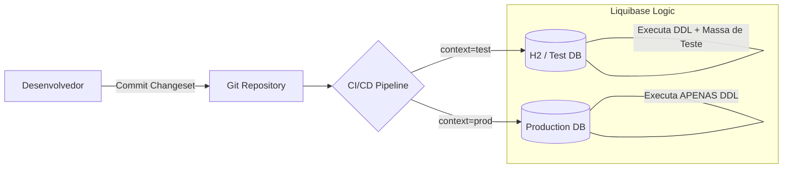

Alterar o esquema de um banco de dados em produção é como trocar o pneu de um carro a 100km/h. Se você ainda depende de scripts SQL manuais executados via terminal, sua aplicação é uma bomba relógio. Para escalar com segurança, precisamos de **Database Migrations** tratadas como código (Version Control).

## O Abismo entre Ambientes

Um dos maiores desafios em pipelines de CI/CD é garantir que scripts específicos (como carga de dados de teste) rodem apenas em ambientes controlados, enquanto alterações de estrutura (DDL) sigam um fluxo rigoroso até a produção. Sem um controle granular, dados sensíveis ou scripts de debug podem "vazar" para o ambiente real.



---

## 1. Por que Liquibase?

Diferente de outras ferramentas que usam apenas SQL, o Liquibase utiliza uma camada de abstração (XML, YAML ou JSON) que o torna independente de banco de dados. O mesmo *changeset* funciona no MySQL, PostgreSQL ou Oracle sem alteração manual.

### Estrutura de um Changeset

```xml
<databaseChangeLog
    xmlns="http://www.liquibase.org/xml/ns/dbchangelog"
    xsi:schemaLocation="http://www.liquibase.org/xml/ns/dbchangelog http://www.liquibase.org/xml/ns/dbchangelog/dbchangelog-4.0.xsd">

    <changeSet id="1" author="augusto">
        <createTable tableName="usuarios">
            <column name="id" type="BIGINT" autoIncrement="true">
                <constraints primaryKey="true" nullable="false"/>
            </column>
            <column name="nome" type="VARCHAR(255)">
                <constraints nullable="false"/>
            </column>
        </createTable>
    </changeSet>
</databaseChangeLog>
```

---

## 2. O Segredo da Esteira: Propriedade "Context"

O atributo `context` é o que permite ao Liquibase decidir em tempo de execução quais scripts devem ser aplicados.

### Exemplo de Configuração por Contexto

Imagine que você quer criar uma tabela (comum a todos) e inserir dados de teste (apenas para QA/Dev).

```xml
<!-- Scripts de Estrutura (Sempre rodam) -->
<changeSet id="2" author="augusto" context="main">
    <addColumn tableName="usuarios">
        <column name="email" type="VARCHAR(100)"/>
    </addColumn>
</changeSet>

<!-- Scripts de Massa de Dados (Apenas QA) -->
<changeSet id="3" author="augusto" context="test">
    <insert tableName="usuarios">
        <column name="nome" value="Usuario de Teste"/>
        <column name="email" value="teste@empresa.com"/>
    </insert>
</changeSet>
```

### Execução na Pipeline

Na sua esteira de CI/CD (Jenkins, GitHub Actions, GitLab), você define qual contexto será ativado através da flag `-Dliquibase.contexts`.

**No ambiente de QA:**
```bash
mvn liquibase:update -Dliquibase.contexts=main,test
```

**No ambiente de Produção:**
```bash
mvn liquibase:update -Dliquibase.contexts=main
```
> O Liquibase irá ignorar silenciosamente o `changeSet id="3"` porque o contexto `test` não foi solicitado na execução de produção.
{: .prompt-info }

---

## 3. Implementação em Java (Spring Boot)

No Spring Boot, basta adicionar a dependência e configurar o `application.yml`. O Spring rodará as migrations automaticamente no startup da aplicação (ou você pode desabilitar e rodar via plugin).

**Maven Dependency:**
```xml
<dependency>
    <groupId>org.liquibase</groupId>
    <artifactId>liquibase-core</artifactId>
</dependency>
```

**application-prod.yml:**
```yaml
spring:
  liquibase:
    change-log: classpath:db/changelog/db.changelog-master.xml
    contexts: prod
```

---

## Takeaway Prático

Para implementar migrations com sucesso e sem sustos, siga este guia:

1. **Nunca altere um ChangeSet já executado:** Se errou no nome de uma coluna, crie um novo ChangeSet corrigindo-a. O Liquibase usa o hash do arquivo para garantir a integridade.
2. **Use Contextos com Rigor:** Utilize `context="test"` para massas de dados e `context="main"` para DDL. Isso evita que scripts pesados ou dados "lixo" cheguem ao cliente final.
3. **Rollback é seu seguro:** Sempre que possível, defina a tag `<rollback>` manualmente em mudanças complexas que o Liquibase não consegue automatizar (como queries SQL puras).

