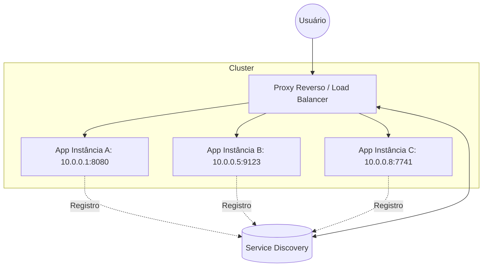

Quando decidimos que uma única instância da nossa aplicação não é mais suficiente, entramos no mundo do escalonamento horizontal. Mas escalar não é apenas subir dez cópias do seu JAR em portas diferentes. O desafio real é: como o tráfego chega até elas? E como o sistema sabe quais instâncias estão vivas?

## O Caos das Portas Dinâmicas

Em um ambiente de containers ou cloud, as instâncias da sua aplicação nascem e morrem com IPs e portas efêmeras. Tentar configurar um balanceador de carga estático com IPs fixos é uma receita para o desastre operacional e *downtimes* constantes.



---

## 1. Proxy Reverso: O Porteiro Inteligente

O Proxy Reverso (como Nginx, HAProxy ou Traefik) atua como o ponto de entrada único. Ele recebe a requisição TLS, faz o *offload* do certificado e a repassa para uma das instâncias internas.

### Exemplo de Configuração Nginx (Load Balancing)

```nginx
# /etc/nginx/conf.d/app.conf
upstream my_app_cluster {
    least_conn; # Algoritmo: envia para quem tem menos conexões ativas
    server 10.0.0.1:8080 max_fails=3 fail_timeout=30s;
    server 10.0.0.2:8080 max_fails=3 fail_timeout=30s;
}

server {
    listen 443 ssl;
    server_name api.meusistema.com;

    location / {
        proxy_pass http://my_app_cluster;
        proxy_set_header Host $host;
        proxy_set_header X-Real-IP $remote_addr;
    }
}
```

---

## 2. Service Discovery: Onde todos se encontram

O **Service Discovery** resolve o problema do "catálogo de endereços". Ferramentas como **Consul**, **Eureka** ou o próprio **Etcd** do Kubernetes mantêm uma lista atualizada de quem está online.

### Implementação com Spring Cloud Netflix Eureka

No Java, o ecossistema Spring torna isso quase transparente.

**Dependência (Maven):**
```xml
<dependency>
    <groupId>org.springframework.cloud</groupId>
    <artifactId>spring-cloud-starter-netflix-eureka-client</artifactId>
</dependency>
```

**Configuração da Aplicação (`application.yml`):**
```yaml
spring:
  application:
    name: order-service

eureka:
  client:
    serviceUrl:
      defaultZone: http://eureka-server:8761/eureka/
  instance:
    prefer-ip-address: true
```

### Funcionamento Interno: O Heartbeat
A aplicação envia um "batimento cardíaco" (*heartbeat*) para o servidor Eureka a cada 30 segundos. Se o servidor parar de receber esse sinal, ele remove a instância do catálogo automaticamente, impedindo que o Proxy envie tráfego para um nó "morto".

---

## 3. Client-Side vs Server-Side Load Balancing

- **Server-Side (Nginx/F5):** O cliente não sabe nada sobre as instâncias. Ele bate no Proxy, e o Proxy decide.
- **Client-Side (Spring Cloud LoadBalancer):** A própria aplicação (Microserviço A) baixa a lista de IPs do Eureka e decide para qual instância do Microserviço B enviar a requisição.

---

## Ferramentas Essenciais

1. **Nginx/Traefik:** Excelentes para entrada de tráfego (Ingress).
2. **HashiCorp Consul:** Robusto, com DNS nativo e suporte a multi-datacenter.
3. **Istio (Service Mesh):** Leva o Proxy Reverso para dentro do pod (Sidecar), controlando a comunicação entre serviços com mTLS.

---

## A Analogia do Restaurante Moderno

Imagine um restaurante extremamente concorrido. 

O **Proxy Reverso** é o *hostess* (recepcionista) na porta: ele garante que nenhum cliente entre direto na cozinha e distribui as pessoas entre as mesas disponíveis para que nenhum garçom fique sobrecarregado.

O **Service Discovery** é o sistema de rádio dos garçons: assim que uma mesa termina a refeição e é limpa, o garçom avisa pelo rádio: "Mesa 5 livre!". O recepcionista ouve e sabe exatamente para onde mandar o próximo cliente. Se um garçom sai para o intervalo, ele avisa que está "offline", e o recepcionista para de mandar pedidos para ele até que ele retorne.

Sem o recepcionista, haveria caos na porta. Sem o rádio, o recepcionista mandaria clientes para mesas que ainda estão sujas. Juntos, eles garantem que o restaurante escale o atendimento sem perder a qualidade.
