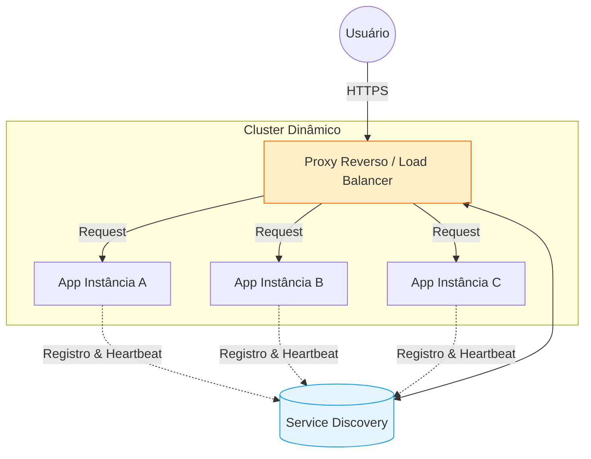

Quando uma aplicação deixa de ser um monólito solitário e passa a operar em um cluster, a complexidade não aumenta apenas linearmente—ela explode. O desafio deixa de ser "como o código executa" e passa a ser "como o tráfego encontra o código". Em ambientes modernos de containers e nuvem, onde endereços IP são tão efêmeros quanto um suspiro, confiar em configurações estáticas é o primeiro passo para o desastre.

## A Efemeridade dos Endereços

Em um cenário de escalonamento horizontal, instâncias da nossa aplicação nascem e morrem constantemente. O Kubernetes pode matar um Pod em um nó e subi-lo em outro com um IP completamente diferente. Se o seu balanceador de carga espera encontrar a aplicação sempre no `10.0.0.5:8080`, qualquer reinicialização causará um *downtime* imediato. 

Abaixo, vemos o fluxo onde o Proxy precisa descobrir dinamicamente quem está pronto para receber carga:



## 1. O Guardião do Tráfego: Proxy Reverso

O Proxy Reverso é a face pública da sua infraestrutura. Além de prover segurança e terminação TLS, sua função primordial no escalonamento é o **Load Balancing**. Ele atua como um intermediário que recebe requisições e as distribui conforme algoritmos específicos (Round Robin, Least Connections, etc).

### Configuração Dinâmica do Nginx

Em um cenário real, você não quer editar o `nginx.conf` manualmente a cada novo container. Existem duas abordagens principais para tornar o Nginx "vivo":

1.  **DNS Resolver (Nativo):** O Nginx consulta um servidor de DNS (como o CoreDNS do Kubernetes ou o DNS do Consul) para resolver o nome do serviço.
2.  **Consul Template (Sidecar):** Uma ferramenta externa monitora o Service Discovery e reescreve o arquivo de configuração do Nginx automaticamente, disparando um `reload`.

Abaixo, um exemplo de configuração usando o **Resolver**, que permite que o Nginx atualize os IPs do cluster sem precisar reiniciar:

```nginx
# file: nginx-cluster.conf
worker_processes auto;

events {
    worker_connections 1024;
}

http {
    # Endereço do Servidor de DNS do Service Discovery (ex: Consul ou K8s)
    # valid=10s força o Nginx a re-checar o DNS a cada 10 segundos
    resolver 127.0.0.1:8600 valid=10s;

    server {
        listen 80;
        server_name api.techblog.com;

        # Redirecionamento para HTTPS
        location / {
            return 301 https://$host$request_uri;
        }
    }

    server {
        listen 443 ssl;
        server_name api.techblog.com;

        # Configuração de Certificados
        ssl_certificate /etc/nginx/ssl/fullchain.pem;
        ssl_certificate_key /etc/nginx/ssl/privkey.pem;

        location / {
            # Usar uma variável força o Nginx a usar o 'resolver' acima 
            # em vez de resolver o IP apenas uma vez no startup.
            set $upstream_endpoint order-service.service.consul;
            
            proxy_pass http://$upstream_endpoint:8080;
            proxy_http_version 1.1;
            
            proxy_set_header Host $host;
            proxy_set_header X-Real-IP $remote_addr;
            proxy_set_header X-Forwarded-For $proxy_add_x_forwarded_for;
            proxy_set_header X-Forwarded-Proto $scheme;

            proxy_connect_timeout 5s;
            proxy_read_timeout 60s;
        }
    }
}
```

## 2. Service Discovery: O Cérebro da Operação

O **Service Discovery** resolve o problema do "catálogo de endereços". Ele é um banco de dados de alta disponibilidade que mantém o mapeamento entre o **Nome do Serviço** (ex: `payment-service`) e seus **Endereços Ativos** (ex: `10.0.5.12:9090`, `10.0.5.15:9090`).

### Por que precisamos dele?
Sem Service Discovery, você teria que atualizar o arquivo `nginx.conf` manualmente a cada novo container que subisse no cluster. O Service Discovery automatiza esse processo: a aplicação se registra ao subir e se remove ao descer.

### Como funciona (Implementação com Spring Cloud)

Para que uma aplicação Java participe dessa orquestra, utilizamos o Eureka ou Consul. Veja o arquivo de configuração completo:

```xml
<!-- file: pom.xml -->
<?xml version="1.0" encoding="UTF-8"?>
<project xmlns="http://maven.apache.org/POM/4.0.0" 
         xmlns:xsi="http://www.w3.org/2001/XMLSchema-instance"
         xsi:schemaLocation="http://maven.apache.org/POM/4.0.0 http://maven.apache.org/xsd/maven-4.0.0.xsd">
    <modelVersion>4.0.0</modelVersion>
    <groupId>com.techblog</groupId>
    <artifactId>order-service</artifactId>
    <version>1.0.0</version>

    <parent>
        <groupId>org.springframework.boot</groupId>
        <artifactId>spring-boot-starter-parent</artifactId>
        <version>3.2.0</version>
    </parent>

    <dependencies>
        <dependency>
            <groupId>org.springframework.boot</groupId>
            <artifactId>spring-boot-starter-web</artifactId>
        </dependency>
        <!-- Dependência vital para o Service Discovery -->
        <dependency>
            <groupId>org.springframework.cloud</groupId>
            <artifactId>spring-cloud-starter-netflix-eureka-client</artifactId>
        </dependency>
    </dependencies>

    <dependencyManagement>
        <dependencies>
            <dependency>
                <groupId>org.springframework.cloud</groupId>
                <artifactId>spring-cloud-dependencies</artifactId>
                <version>2023.0.0</version>
                <type>pom</type>
                <scope>import</scope>
            </dependency>
        </dependencies>
    </dependencyManagement>
</project>
```

```yaml
# file: src/main/resources/application.yml
server:
  port: 8080

spring:
  application:
    name: order-service # Nome pelo qual o serviço será encontrado no cluster

eureka:
  client:
    serviceUrl:
      # Endereço do servidor central de descoberta
      defaultZone: http://eureka-server:8761/eureka/
    # Frequência de atualização da lista local de outros serviços
    registry-fetch-interval-seconds: 30
  instance:
    # Registra o IP ao invés do hostname (mais robusto em redes Docker)
    prefer-ip-address: true
    # Intervalo de envio do Heartbeat
    lease-renewal-interval-in-seconds: 30
```

## 3. O Mecanismo do Heartbeat

O Service Discovery não apenas "anota" o endereço; ele vigia a saúde da aplicação.
- **Auto-registro:** Ao iniciar, a App envia um POST para o Discovery Server com seu IP/Porta.
- **Heartbeat:** A cada N segundos (ex: 30s), a App envia um "estou viva".
- **Eviction:** Se o Discovery Server ficar 90 segundos sem ouvir a App, ele a remove do catálogo. O Proxy, então, para de enviar tráfego para ela.

## Tradeoffs: A Moeda de Troca da Automação

Nada é de graça em arquitetura de sistemas. Adotar Service Discovery traz compromissos sérios:

1. **Consistência Eventual vs. Disponibilidade:** Se o servidor de descoberta demora a remover um nó morto, o Proxy pode enviar requisições para o limbo por alguns milissegundos.
2. **Complexidade Operacional:** Agora você tem um novo "ponto crítico" (o Discovery Server). Se ele cair, novos serviços não podem entrar e a rede pode ficar cega.
3. **Latência de Inicialização:** A aplicação agora depende da rede estar pronta para se registrar antes de poder receber tráfego real.
4. **Tráfego de Rede:** Milhares de instâncias enviando heartbeats a cada 30 segundos geram uma carga constante de ruído na rede.

## Alternativas ao Service Discovery

Se a complexidade de manter um Eureka ou Consul parece alta demais, existem caminhos alternativos:

1.  **DNS Round Robin:** Configurar múltiplos registros `A` para o mesmo domínio. Simples, mas sem *health checks* inteligentes (o DNS continuará entregando IPs de instâncias mortas até o TTL expirar).
2.  **Cloud Load Balancers (LBAAS):** AWS ALB ou Google Cloud Load Balancer gerenciam o registro de instâncias automaticamente através de *Target Groups*. Você delega o Discovery para o provedor de nuvem.
3.  **Configuração Estática via CI/CD:** O seu pipeline de deploy atualiza o arquivo de configuração do Load Balancer a cada nova versão. Funciona bem para ambientes que não escalam automaticamente (Auto-scaling).
4.  **Service Mesh (Istio/Linkerd):** Leva o discovery para o nível da rede (L7). Cada serviço tem um Proxy (Sidecar) que conhece todos os outros serviços, eliminando a necessidade de lógica de discovery dentro do código da aplicação.

## Aplicações Práticas

No mundo real, essa arquitetura é o que permite que empresas como a Netflix lidem com milhares de microserviços. Se o Kubernetes é o orquestrador que decide *onde* os containers rodam, o Service Discovery é o sistema de som que avisa para *onde* os dados devem fluir.

### Takeaway Prático
Se você está começando um projeto com menos de 3 instâncias fixas, o Service Discovery pode ser um *over-engineering*. Mas, no momento em que você decide usar **Auto-scaling** (onde instâncias sobem sozinhas via métricas de CPU), o Service Discovery torna-se obrigatório. Sem ele, seu sistema é um carro veloz, mas sem volante.
