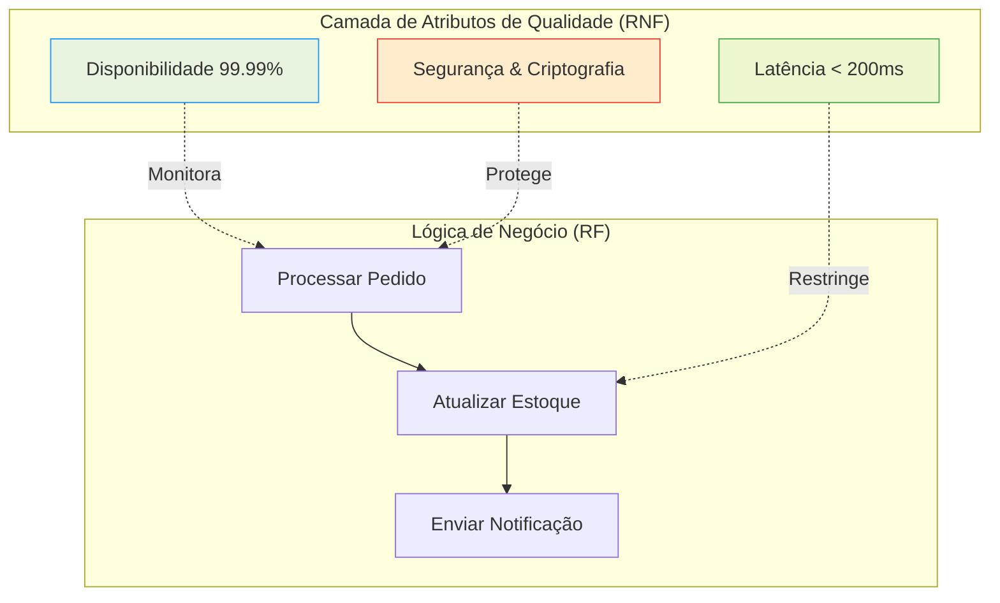

No dia a dia do desenvolvimento, é tentador focar exclusivamente na "entrega de valor"—o botão que o usuário clica, o JSON que a API retorna. No entanto, a diferença entre um sistema de sucesso e um desastre em produção raramente reside na lógica de negócio mal implementada, mas sim na negligência dos pilares que sustentam essa lógica. Estamos falando da dualidade entre **Requisitos Funcionais (RF)** e **Requisitos Não Funcionais (RNF)**.

## O Limite da Funcionalidade Pura

Um sistema que "funciona" mas leva 30 segundos para responder é, para todos os efeitos práticos, um sistema quebrado. Requisitos funcionais descrevem o **comportamento** (o que o sistema faz), enquanto os não funcionais descrevem as **restrições** e os **atributos de qualidade** (como o sistema deve ser).

Abaixo, vemos como os RNFs envolvem e protegem a execução dos RFs em uma arquitetura resiliente:



---

## 1. Requisitos Funcionais: A Intencionalidade do Código

Os RFs são os verbos do seu sistema: *criar*, *deletar*, *validar*, *gerar*. Eles são facilmente validados por Testes de Unidade e de Integração.

**Exemplo de RF:** "O sistema deve permitir que o usuário cancele uma transação de pagamento em até 24 horas após a aprovação."

---

## 2. Requisitos Não Funcionais: Os Atributos de Qualidade

Os RNFs são os adjetivos e advérbios. Eles são mais difíceis de testar e frequentemente exigem testes de carga, auditorias de segurança e análise de infraestrutura. Eles se dividem em categorias críticas:

- **Escalabilidade:** O sistema deve suportar 10.000 requisições simultâneas sem degradação linear de performance.
- **Observabilidade:** Todas as exceções críticas devem ser enviadas ao Sentry em menos de 1 segundo.
- **Portabilidade:** A aplicação deve rodar em containers Docker sem dependência de SO específico.

---

## 3. Implementando a Convergência no Código

Um erro comum é tentar "separar" os RNFs da lógica. Na prática, eles devem estar entrelaçados. Veja um exemplo completo em Java (Spring Boot) de um serviço que atende a um RF (Processar Pagamento) respeitando múltiplos RNFs (Logging, Validação, Resiliência e Métricas).

```java
// file: src/main/java/com/techblog/payment/service/PaymentProcessor.java
package com.techblog.payment.service;

import io.micrometer.core.instrument.MeterRegistry;
import io.micrometer.core.instrument.Timer;
import org.slf4j.Logger;
import org.slf4j.LoggerFactory;
import org.springframework.stereotype.Service;
import org.springframework.transaction.annotation.Transactional;
import org.springframework.validation.annotation.Validated;

import java.math.BigDecimal;
import java.util.UUID;

/**
 * RF: Processar pagamento de pedido.
 * RNF Associados: Transacionalidade, Auditabilidade, Observabilidade e Performance.
 */
@Service
@Validated
public class PaymentProcessor {

    private static final Logger auditLogger = LoggerFactory.getLogger("AUDIT_LOG");
    private final MeterRegistry meterRegistry;

    public PaymentProcessor(MeterRegistry meterRegistry) {
        this.meterRegistry = meterRegistry;
    }

    @Transactional
    public PaymentResult execute(UUID orderId, BigDecimal amount) {
        // RNF: Performance - Medição de latência para SLO
        Timer.Sample sample = Timer.start(meterRegistry);
        
        try {
            // RF: Validação de Negócio
            if (amount.compareTo(BigDecimal.ZERO) <= 0) {
                throw new IllegalArgumentException("Valor da transação deve ser positivo");
            }

            // Simulação de lógica de processamento
            String transactionId = UUID.randomUUID().toString();
            
            // RF: Persistência do estado (Garantido pelo RNF de Transacionalidade)
            // repository.save(new Payment(orderId, amount, transactionId));

            // RNF: Auditabilidade - Log imutável para conformidade
            auditLogger.info("PAYMENT_SUCCESS: OrderId={}, Amount={}, TxId={}", orderId, amount, transactionId);

            // RNF: Observabilidade - Incremento de contador de sucesso
            meterRegistry.counter("payment.processed.success").increment();

            return new PaymentResult(transactionId, "APPROVED");

        } catch (Exception e) {
            // RNF: Resiliência e Observabilidade - Log de erro e métrica de falha
            auditLogger.error("PAYMENT_FAILED: OrderId={}, Reason={}", orderId, e.getMessage());
            meterRegistry.counter("payment.processed.error").increment();
            throw e;
        } finally {
            // RNF: Registro final de métrica de tempo para Dashboards de SRE
            sample.stop(meterRegistry.timer("payment.processing.time"));
        }
    }

    public record PaymentResult(String transactionId, String status) {}
}
```

---

## Tradeoffs: A Luta entre o Ótimo e o Real

Projetar requisitos não funcionais exige escolhas difíceis. Frequentemente, um RNF entra em conflito direto com outro:

1.  **Segurança vs. Performance:** Adicionar múltiplas camadas de criptografia e mTLS entre microserviços aumenta a segurança (RNF), mas introduz latência (RNF de Performance).
2.  **Consistência vs. Disponibilidade:** O clássico Teorema CAP. Se você precisa de consistência total em um sistema distribuído, terá que sacrificar a disponibilidade durante uma falha de rede.
3.  **Flexibilidade vs. Complexidade:** Implementar uma arquitetura plugável permite grande portabilidade, mas aumenta drasticamente o tempo de desenvolvimento e o custo de manutenção.

---

## O Custo da Dívida Técnica Não Funcional

Ignorar requisitos não funcionais é como construir uma casa linda sobre um pântano. No início, as janelas (RFs) abrem e fecham perfeitamente. Com o tempo, o solo cede. 

Uma aplicação que ignora a escalabilidade sofrerá quando o marketing fizer uma campanha de sucesso. Uma aplicação que ignora a observabilidade deixará o desenvolvedor cego durante um incidente em produção, transformando um bug de 10 minutos em um downtime de 10 horas.

### Takeaway Prático: A Checklist de Definição de Pronto (DoD)
Para cada nova funcionalidade (RF), pergunte-se sobre os RNFs:
- Existe um limite de tempo aceitável para essa operação?
- Como saberemos se ela falhou sem olhar o banco de dados?
- Quem tem permissão para disparar essa ação?
- O que acontece se o volume de dados triplicar amanhã?

Se você não tem essas respostas, o seu requisito funcional ainda não está pronto para o mundo real.
