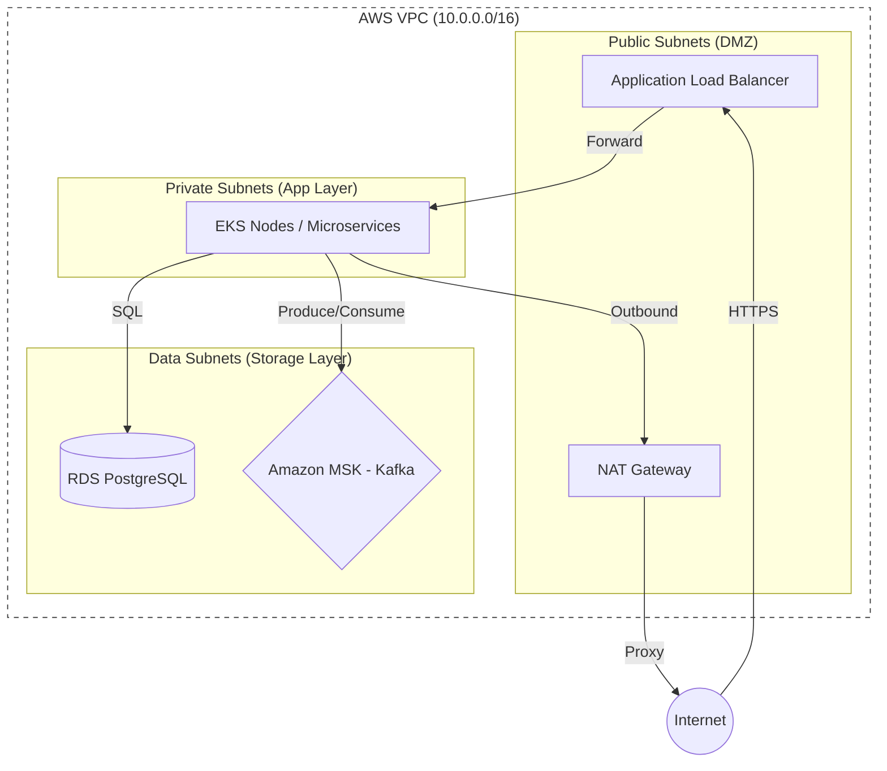
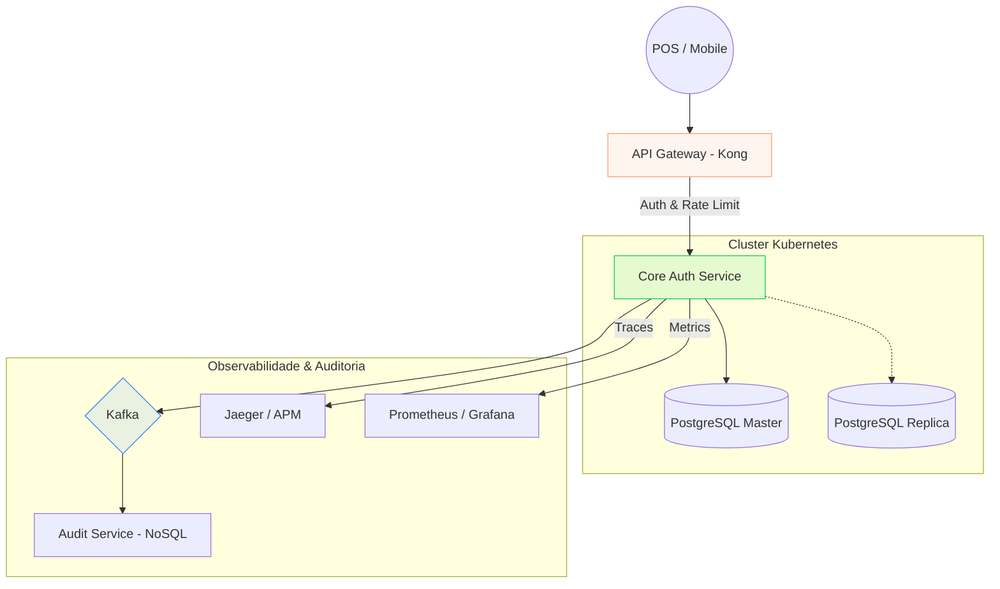

Projetar o backend de um sistema de cartão multibenefícios que processa milhares de transações por segundo é um dos desafios mais complexos em fintechs. O objetivo não é apenas criar um CRUD, mas garantir **consistência financeira absoluta**, **baixa latência**, **auditoria total** e uma **infraestrutura elástica**.

Neste guia, detalho como eu desenharia essa arquitetura, desde a modelagem do banco de dados até a esteira de deploy e resiliência em nuvem.

## 1. Modelagem de Domínio e Ledger Financeiro

Em sistemas de benefícios, o usuário possui múltiplos "bolsos" (Refeição, Alimentação, Mobilidade, Saúde). A abordagem correta aqui é o padrão de **Double-entry Ledger (Livro-razão de Partida Dobrada)**. O saldo real não é um campo estático, mas o resultado de lançamentos imutáveis.

### A Fonte da Verdade e a Performance (Snapshots)
Embora o saldo seja o resultado da `SUM()` de lançamentos, somar milhares de transações a cada autorização destruiria a performance.
- **A Solução (Snapshots):** Mantemos uma tabela de `balance_snapshots`. Utilizamos o valor do último snapshot consolidado e somamos apenas os lançamentos que ocorreram *após* a data desse snapshot.
    - *Exemplo:* Se o último snapshot diz R$ 100,00 e houve um gasto recente de R$ 20,00, o saldo é `100 - 20 = 80`. Isso evita processar anos de histórico em milissegundos.

```sql
-- file="modelagem-ledger.sql"
CREATE TABLE ledger_entries (
    id UUID PRIMARY KEY,
    wallet_id UUID NOT NULL,
    transaction_id UUID NOT NULL UNIQUE, 
    amount DECIMAL(19, 4) NOT NULL,
    created_at TIMESTAMP DEFAULT CURRENT_TIMESTAMP
);

CREATE TABLE balance_snapshots (
    wallet_id UUID PRIMARY KEY,
    last_entry_id UUID NOT NULL,
    balance DECIMAL(19, 4) NOT NULL,
    updated_at TIMESTAMP DEFAULT CURRENT_TIMESTAMP
);
```
{: .nolineno }

*Insight:* Periodicamente (ex: a cada 100 transações ou 24h), um worker atualiza o snapshot, "limpando" o peso computacional da soma.

## 2. Estratégia de API Gateway: Segurança e Controle

Como ponto único de entrada, utilizamos um **API Gateway (ex: Kong ou AWS API Gateway)** para resolver preocupações transversais (*cross-cutting concerns*):
1.  **AuthN/AuthZ:** Validação rigorosa de JWT ou mTLS antes da requisição tocar no microserviço.
2.  **Rate Limiting:** Implementação de limites por parceiro para evitar abusos e garantir o *fair use* dos recursos.
3.  **Audit Trail Inicial:** Log de cada tentativa de acesso para rastreabilidade e segurança.

## 3. Concorrência e Idempotência Rigorosa

Para evitar débitos duplos em casos de reenvio por timeout de rede, utilizamos **Idempotência**. O processador envia um `External-ID` que é gravado no banco como chave única.

Para a concorrência, aplicamos **Optimistic Locking** (`@Version`) no registro da carteira, garantindo que o saldo verificado não mudou entre a leitura e a escrita do débito.

## 4. Observabilidade Profunda (Três Pilares)

Em um sistema crítico, a visibilidade é fundamental. Implementamos:
1.  **Métricas (Prometheus/Grafana):** Foco no "Triângulo de Ouro": Taxa de Erros, Latência (p99) e Throughput.
2.  **Logs Estruturados (ELK/Loki):** Cada transação gera um log em JSON com o `External-ID`.
3.  **Distributed Tracing (Jaeger/Datadog):** Injeção de um `Trace-ID` no Gateway para visualizar gargalos em milissegundos, seja no banco ou em APIs externas.

## 5. Autoscaling Proativo com KEDA e HPA

Para sobreviver a picos previsíveis (como o horário de almoço às 12h), combinamos duas estratégias:
- **HPA por RPS:** Escalonamento reativo baseado em requisições por segundo.
- **KEDA (Cron Scaler):** Escalonamento **proativo**. Configuramos o KEDA para subir os pods às 11:30 AM. Quando o pico de transações chega, o cluster já está "quente" e pronto.

## 6. Topologia de Rede e Infraestrutura (AWS + Terraform)

A infraestrutura é isolada em uma **VPC** com camadas de subnets rigorosas utilizando **Terraform**:
1.  **Public Subnets (DMZ):** ALB (Application Load Balancer) e NAT Gateways.
2.  **Private Subnets (App Layer):** Nodes do EKS (Kubernetes) sem IPs públicos.
3.  **Data Subnets (Storage Layer):** RDS (PostgreSQL) e MSK (Kafka), acessíveis apenas pela App Layer via Security Groups.

```hcl
# file="vpc-infra.tf"
module "vpc" {
  source  = "terraform-aws-modules/vpc/aws"
  version = "5.0.0"
  # ... configuração de AZs e Subnets (Public, Private, Database)
  enable_nat_gateway = true
  single_nat_gateway = false
}
```
{: .nolineno }

### Diagrama de Infraestrutura AWS



## 7. Desafios de Produção e "Day 2 Operations"

Para manter o sistema saudável a longo prazo, aplicamos:
- **Cache de Escrita (Redis):** Saldo atual em cache para autorização ultra-rápida, com persistência no Ledger.
- **Tokenização (PCI-DSS):** O backend processa apenas tokens, nunca o PAN real do cartão.
- **Rollout Progressivo:** Deploy via GitLab CI + Helm com `RollingUpdate`, monitorando métricas de saúde antes de completar a virada de versão.
- **Disaster Recovery:** Replicação cross-region para garantir RTO baixo em caso de falha regional.

## 8. Inteligência de Roteamento e Atomicidade de Dados

O roteamento de benefícios baseia-se no **MCC (Merchant Category Code)**:
- `MCC 5812` → Débito no bolso **Refeição**.
- `MCC 5411` → Débito no bolso **Alimentação**.

Para garantir que notificações não se percam, utilizamos o **Transactional Outbox Pattern**. O evento é salvo na mesma transação do débito e um *Relay* o envia para o Kafka posteriormente.

## 9. Fluxo da Transação em Tempo Real (Step-by-Step)

1.  **Origem:** O usuário aproxima o cartão no POS (maquininha).
2.  **Entrada:** O Processador chama o nosso **API Gateway**.
3.  **Auth Service:**
    - **Identificação:** Mapeia o token para o usuário.
    - **Fraude:** Consulta o *Fraud Engine* (score de risco e geolocalização).
    - **Roteamento:** Identifica a categoria pelo MCC.
    - **Saldo:** Valida via `Snapshot` + `SUM()` delta.
    - **Persistência:** Grava débito no Ledger e evento no Outbox em uma única transação.
4.  **Resposta:** Retorna `200 OK` (Aprovado) em menos de 200ms.
5.  **Notificação:** O Relay envia o evento do Outbox para o Kafka, disparando o Push no celular.

## Arquitetura de Alto Nível (System Design)



## Conclusão: O "Preço" da Excelência

Escalabilidade em sistemas financeiros não é apenas sobre hardware potente, mas sobre **desacoplamento inteligente** e **integridade transacional**. 
- O fluxo crítico deve ser síncrono e transacional.
- O fluxo secundário deve ser assíncrono e resiliente.
- A infraestrutura deve ser invisível, elástica e totalmente monitorada.

Ao seguir este design, construímos uma plataforma que sustenta a confiança financeira de milhões de usuários sob qualquer carga.
