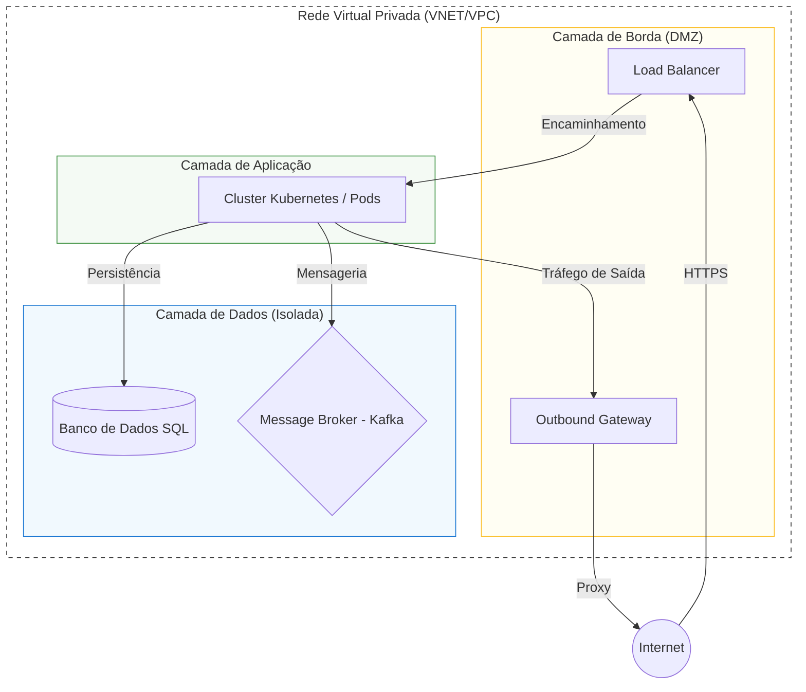
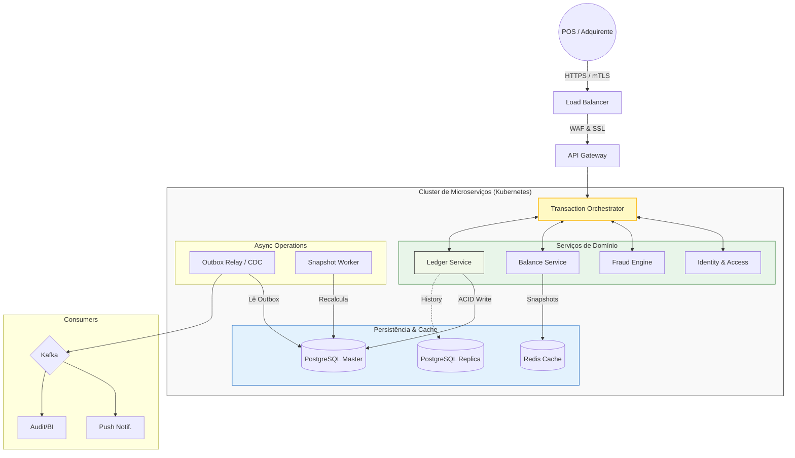

Projetar o backend de um sistema de cartão multibenefícios que processa milhares de transações por segundo é um dos desafios mais complexos em fintechs. O objetivo não é apenas criar um CRUD, mas garantir **consistência financeira absoluta**, **baixa latência**, **auditoria total** e uma **infraestrutura elástica**.

{: .prompt-tip }
>  Vou sempre questionar sobre a stack tecnológica homologada pela empresa (Ex: AWS vs Azure, Java vs Go). Evitando se prender a provedores específicos logo de início; o foco deve ser na **solução arquitetural agnóstica**.

Neste guia, detalho como eu desenharia essa arquitetura, desde a modelagem do banco de dados até a resiliência em nuvem.

## 1. Modelagem de Domínio e Ledger Service (Livro-Razão)

Em sistemas de benefícios, o usuário possui múltiplos "bolsos" (Refeição, Alimentação, Mobilidade, Saúde). A abordagem correta aqui é o padrão de **Double-entry Ledger (Livro-razão de Partida Dobrada)**.

### O Funcionamento do Ledger Service
O **Ledger Service** é o guardião da verdade financeira. Ele não apenas armazena saldos, mas registra cada movimentação como um evento imutável de crédito e débito.
- **Atomicidade:** Cada transação financeira gera no mínimo dois lançamentos: um débito na sub-conta de benefício do usuário e um crédito na conta de liquidação do merchant (ou uma conta transitória da própria plataforma).
- **Imutabilidade:** Lançamentos nunca são editados ou excluídos. Erros são corrigidos com novos lançamentos de estorno.
- **Hierarquia de Contas:** Cada grupo de benefício (Refeição, Alimentação) é tratado como uma sub-conta independente vinculada ao `wallet_id` do usuário.

### A Fonte da Verdade e a Performance (Snapshots)
Embora o saldo seja o resultado da `SUM()` de lançamentos, somar milhares de transações a cada autorização destruiria a performance.
- **A Solução (Snapshots):** Mantemos uma tabela de `balance_snapshots`. Utilizamos o valor do último snapshot consolidado e somamos apenas os lançamentos que ocorreram *após* a data desse snapshot.
    - *Exemplo:* Se o último snapshot diz R$ 100,00 e houve um gasto recente de R$ 20,00, o saldo é `100 - 20 = 80`. Isso evita processar anos de histórico em milissegundos.

```sql
-- file="modelagem-ledger.sql"
CREATE TABLE benefit_groups (
    id UUID PRIMARY KEY,
    name VARCHAR(50) NOT NULL, -- Ex: Refeição, Alimentação, Mobilidade
    slug VARCHAR(50) UNIQUE NOT NULL
);

CREATE TABLE benefit_mcc_configs (
    mcc_code VARCHAR(4) PRIMARY KEY,
    benefit_group_id UUID NOT NULL REFERENCES benefit_groups(id)
);

-- O coração do sistema: imutável e atômico
CREATE TABLE ledger_entries (
    id UUID PRIMARY KEY,
    wallet_id UUID NOT NULL, 
    benefit_group_id UUID NOT NULL REFERENCES benefit_groups(id),
    transaction_id UUID NOT NULL UNIQUE, 
    type ENUM('DEBIT', 'CREDIT') NOT NULL, -- Partida Dobrada
    amount DECIMAL(19, 4) NOT NULL,
    created_at TIMESTAMP DEFAULT CURRENT_TIMESTAMP
);

CREATE TABLE balance_snapshots (
    wallet_id UUID PRIMARY KEY,
    benefit_group_id UUID NOT NULL,
    last_entry_id UUID NOT NULL,
    balance DECIMAL(19, 4) NOT NULL,
    version BIGINT NOT NULL DEFAULT 0, -- Necessário para Optimistic Locking
    updated_at TIMESTAMP DEFAULT CURRENT_TIMESTAMP
);
```
{: .nolineno }

*Insight:* Adicionar o `benefit_group_id` no Ledger é uma denormalização estratégica. Isso permite auditorias ultra-rápidas e facilita o particionamento físico da tabela por tipo de benefício à medida que o volume de dados cresce. Periodicamente (ex: a cada 100 transações ou 24h), um worker atualiza o snapshot e a `version`, "limpando" o peso computacional da soma e servindo de base para o controle de concorrência.

## 2. Estratégia de API Gateway e Identity Service

O **API Gateway** é o ponto único de entrada, mas ele delega a inteligência de acesso para o **Identity & Access Service**.

### Responsabilidades do Identity Service:
1.  **Validação de Credenciais:** Verifica se o processador/parceiro que está chamando a API possui um token JWT válido e mTLS configurado.
2.  **Estado da Entidade (Cartão/Usuário):** Antes de qualquer lógica financeira, este serviço valida se o cartão está Ativo. Se estiver Bloqueado por perda ou Cancelado, a transação morre aqui, economizando recursos dos serviços posteriores.
3.  **Mapeamento de Contexto:** Traduz o identificador técnico (PAN tokenizado) no `User-ID` interno e suas permissões globais.

## 3. Concorrência e Idempotência Rigorosa

Para evitar débitos duplos em casos de reenvio por timeout de rede, utilizamos **Idempotência**. O processador envia um `External-ID` que é gravado no banco como chave única.

Quanto à concorrência, temos duas abordagens principais para garantir que o saldo não mude entre a leitura e a escrita:
- **Optimistic Locking (`@Version`):** Utilizamos a coluna `version` na tabela `balance_snapshots`. Se dois processos tentarem atualizar o saldo simultaneamente, o segundo falhará ao notar que a versão mudou, forçando um retry. É excelente para alta escala com baixa contenção por usuário.
- **Pessimistic Locking (`SELECT FOR UPDATE`):** Para cenários de altíssima criticidade ou contenção, bloqueamos a linha do snapshot/wallet durante a transação. Isso garante que ninguém mais toque no saldo até que o débito seja confirmado, alinhando-se com a **Orquestração Síncrona Pessimista** que detalharemos adiante.

## 4. Observabilidade Profunda: Detecção, Causalidade e Ciclo de Vida

Em um sistema que processa dinheiro, "não saber o que está acontecendo" é o maior risco operacional. Implementamos a observabilidade não apenas para ver se o sistema está "up", mas para entender o comportamento real de cada transação de forma agnóstica a ferramentas.

### 1. Métricas de Série Temporal (Saúde Global)
Utilizamos métricas para detecção rápida de anomalias através dos "Sinais de Ouro" (Golden Signals).
- **O que faz:** Agrega dados numéricos em janelas de tempo para gerar alertas automáticos.
- **Exemplo Prático:** Monitoramos a taxa de `Erros 4xx` por adquirente. Se uma adquirente específica começar a retornar 5% de erro, o sistema dispara um alerta antes mesmo de um usuário reclamar.
- **Métricas Chave:** Throughput (RPS), Latência (p99 de 150ms), e Saturação (uso de pool de conexões do banco).

### 2. Logs Estruturados e Centralizados (Causalidade)
Enquanto a métrica diz *que* algo está errado, o log diz *o que* aconteceu com um evento específico.
- **O que faz:** Grava eventos em formato estruturado (JSON) com metadados contextuais, permitindo buscas complexas e centralizadas.
- **Exemplo Prático:** Cada log de erro de autorização deve conter o `External-ID`, o `MCC` e o `User-ID`. Isso permite que o suporte busque instantaneamente por "Por que a transação X do usuário Y foi negada?".
- **Atributo Essencial:** `Correlation-ID`. Um identificador único que nasce no Gateway e viaja por todos os microserviços, unindo logs de sistemas diferentes sob o mesmo contexto.

### 3. Rastreamento Distribuído (Gargalos e Fluxo)
O rastreamento (Tracing) permite visualizar o "caminho" de uma única requisição através da malha de microserviços.
- **O que faz:** Gera um grafo de chamadas (Spans) com o tempo gasto em cada etapa do processo.
- **Exemplo Prático:** Se uma transação demorou 1 segundo (muito lento), o Trace mostrará visualmente que o banco de dados respondeu em 20ms, mas a chamada externa para o *Fraud Engine* demorou 900ms.
- **Aplicação:** Identificação de latência na rede, timeouts mal configurados e chamadas desnecessárias que podem ser otimizadas ou feitas de forma assíncrona.

## 5. Autoscaling Proativo com KEDA e HPA

Para sobreviver a picos previsíveis (como o horário de almoço às 12h), combinamos duas estratégias:
- **HPA por RPS:** Escalonamento reativo baseado em requisições por segundo.
- **KEDA (Cron Scaler):** Escalonamento **proativo**. Configuramos o KEDA para subir os pods às 11:30 AM. Quando o pico de transações chega, o cluster já está "quente" e pronto.

## 6. Topologia de Rede e Isolamento de Camadas

A infraestrutura é desenhada seguindo o princípio de **Defesa em Profundidade**, utilizando uma **Rede Virtual Privada** segmentada em camadas de confiança. A automação via **Infraestrutura como Código (IaC)** garante que o isolamento seja replicável e auditável.

### Segmentação por Camadas (Tiered Subnets)
Dividimos a rede em três níveis de acesso, garantindo que uma falha em uma camada não exponha diretamente a outra:

1.  **Camada de Borda (Public/DMZ(Zona Desmilitarizada)):** Contém os **Load Balancers** e gateways de saída. É o único ponto que aceita conexões vindas da internet. O tráfego aqui é estritamente HTTPS e protegido por WAF (Web Application Firewall).
2.  **Camada de Aplicação (Private/App):** Onde reside o cluster de **Orquestração de Containers (Kubernetes)**. Os nós não possuem endereços IP públicos e só podem ser acessados pelo Load Balancer da camada de borda.
3.  **Camada de Dados (Isolated/Data):** Onde ficam os **Bancos de Dados Relacionais** e os **Message Brokers (Kafka)**. Esta zona é totalmente isolada, permitindo conexões apenas da camada de aplicação através de regras de firewall restritas por porta e protocolo.

### Fluxo de Tráfego e Segurança
O tráfego segue o princípio do **Menor Privilégio**:
- **Entrada:** Internet → Load Balancer (Terminação SSL) → Microserviços (App Layer).
- **Saída:** App Layer → Gateway de Saída → APIs Externas (Bandeiras/Processadores).
- **Interno:** App Layer ↔ Isolated Data Layer (via redes privadas de alta velocidade).

### Diagrama de Topologia de Rede



## 7. Desafios de Produção e "Day 2 Operations"

Para manter o sistema saudável a longo prazo, aplicamos:
- **Cache de Escrita (Redis):** Saldo atual em cache para autorização ultra-rápida, com persistência no Ledger.
- **Tokenização (PCI-DSS):** O backend processa apenas tokens, nunca o PAN real do cartão.
- **Rollout Progressivo:** Deploy via GitLab CI + Helm com `RollingUpdate`, monitorando métricas de saúde antes de completar a virada de versão.
- **Disaster Recovery:** Replicação cross-region para garantir RTO baixo em caso de falha regional.

## 8. Inteligência de Roteamento e Atomicidade de Dados

O roteamento de benefícios baseia-se na consulta à tabela `benefit_mcc_configs` utilizando o **MCC (Merchant Category Code)** enviado pelo processador:
- O sistema busca o `benefit_group_id` vinculado ao MCC da transação.
- Exemplo: `MCC 5812` mapeado para o grupo **Refeição**.
- **Estratégia de Fallback:** Se o bolso principal não tiver saldo, o sistema pode buscar no "Saldo Livre" (bolso genérico), conforme configurado na regra de negócio.

Para garantir que notificações não se percam, utilizamos o **Transactional Outbox Pattern**. O evento é salvo na mesma transação do débito e um *Relay* o envia para o Kafka posteriormente, garantindo que a notificação ocorra mesmo após falhas temporárias do broker.

## 9. Fluxo da Transação e Estratégia Transacional

Diferente de fluxos assíncronos de e-commerce, a autorização de cartão exige uma resposta imediata (< 200ms). Para garantir isso com integridade, utilizamos **Orquestração Síncrona Pessimista**.

### Por que não 2-Phase Commit (2PC) ou Saga?
- **2PC:** Embora garanta atomicidade, causa *locking* de recursos por muito tempo, o que é proibitivo em alta escala e aumenta drasticamente a latência.
- **Saga:** Excelente para processos de longa duração, mas a complexidade de gerenciar transações compensatórias em milissegundos introduz riscos de inconsistência temporária que não são aceitáveis em débitos financeiros diretos.

### A Solução: Orquestração com "Pre-flight Checks"
O **Transaction Orchestrator** coordena o fluxo em duas fases lógicas dentro de uma única request:

1.  **Fase de Validação (Síncrona):** O Orquestrador consulta o **Identity Service** (cartão ok?), o **Fraud Engine** (score ok?) e o **Balance Service** (saldo ok?). Se qualquer um falhar, a transação é abortada imediatamente com erro 4xx/5xx.
2.  **Fase de Commit (Atômica):** Se todas as validações passarem, o Orquestrador chama o **Ledger Service**. Este serviço abre uma transação SQL ACID local, grava o débito imutável e insere o evento na tabela de **Outbox**. Uma vez que o banco responde "Commit", a transação é considerada final e a resposta 200 OK é enviada ao parceiro.

### Arquitetura de Alto Nível (System Design)

Abaixo, a consolidação visual da arquitetura distribuída.



## Uma Jornada de Evolução Contínua

Projetar um sistema de alta escala e missão crítica como uma Ledger financeira é um exercício constante de equilíbrio entre **baixa latência** e **consistência absoluta**. Ao focar em padrões agnósticos, desacoplamento inteligente e integridade transacional, criamos uma base resiliente capaz de suportar o crescimento do negócio e evoluir tecnologicamente.

Entretanto, é fundamental reforçar que este desenho é uma **proposta conceitual**. No "mundo real", a construção de uma arquitetura deste porte jamais seria um esforço isolado. O próximo passo seria submeter este design a um **Architecture Review Board (ARB)**, discutindo cada decisão com meus pares para identificar casos de borda e potenciais pontos de falha que uma visão única pode omitir.

Além disso, antes de qualquer linha de código ir para produção, realizaria **POCs (Provas de Conceito)** rigorosas para validar as premissas de latência de rede entre microserviços e a performance do banco sob carga extrema. Lidar com dinheiro exige uma humildade técnica que prioriza a segurança e a validação empírica acima de qualquer "desenho perfeito" no papel.
