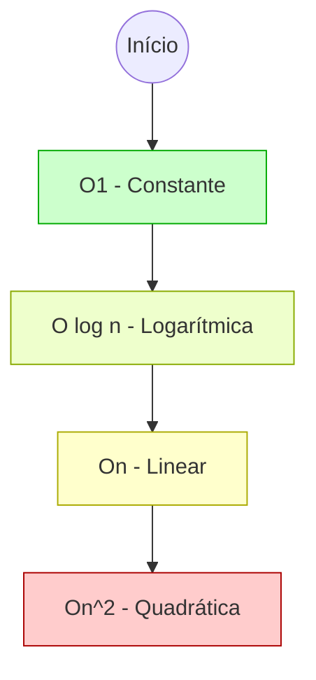

A **Big O Notation** (Notação Grande-O) é a linguagem que utilizamos para descrever o comportamento de um algoritmo à medida que o tamanho dos dados de entrada ($n$) cresce. Ela não mede segundos, mas sim o crescimento do número de operações ou do uso de memória.

## A Ilusão do Tempo de Execução

Depender de milissegundos para medir performance é perigoso porque o tempo é afetado por variáveis externas: o processador, a carga da CPU no momento, a versão da JVM e até a temperatura do hardware. Se você tem um array de 10 elementos, qualquer algoritmo parece instantâneo. O problema surge quando $n$ passa de 10 para 10 milhões.

A Big O foca no **pior cenário** (*worst-case scenario*). Ela nos dá uma garantia teórica: "não importa o quão lenta seja a máquina, este algoritmo nunca crescerá mais rápido do que esta curva".

## As Classes de Complexidade Comuns

Vamos analisar as complexidades mais encontradas no dia a dia do desenvolvimento Java, do mais eficiente para o menos escalável.

### 1. O(1) - Complexidade Constante

O tempo de execução não muda, independentemente do tamanho da entrada. É o "Santo Graal" da performance.

```java
public class ArrayAccess {
    public int getFirstElement(int[] numbers) {
        if (numbers == null || numbers.length == 0) {
            return -1;
        }
        return numbers[0]; // Acesso direto por índice é sempre O(1)
    }
}
```

### 2. O(log n) - Complexidade Logarítmica

Extremamente eficiente. À medida que os dados dobram, o número de operações aumenta apenas em uma unidade. É a base da **Busca Binária**.

```java
public class BinarySearch {
    public int search(int[] sortedArray, int target) {
        int low = 0;
        int high = sortedArray.length - 1;

        while (low <= high) {
            int mid = low + (high - low) / 2;
            if (sortedArray[mid] == target) {
                return mid;
            } else if (sortedArray[mid] < target) {
                low = mid + 1;
            } else {
                high = mid - 1;
            }
        }
        return -1;
    }
}
```

### 3. O(n) - Complexidade Linear

O esforço é proporcional ao tamanho da entrada. Se você tem o dobro de itens, levará o dobro do tempo.

```java
public class LinearSearch {
    public boolean contains(int[] numbers, int target) {
        for (int number : numbers) {
            if (number == target) {
                return true;
            }
        }
        return false;
    }
}
```

### 4. O(n²) - Complexidade Quadrática

Comum em algoritmos que utilizam loops aninhados. É o ponto onde a performance começa a colapsar em grandes volumes de dados.

```java
public class BubbleSort {
    public void sort(int[] numbers) {
        int n = numbers.length;
        for (int i = 0; i < n - 1; i++) {
            for (int j = 0; j < n - i - 1; j++) {
                if (numbers[j] > numbers[j + 1]) {
                    int temp = numbers[j];
                    numbers[j] = numbers[j + 1];
                    numbers[j + 1] = temp;
                }
            }
        }
    }
}
```

## Visualizando o Crescimento

O diagrama abaixo ilustra como a diferença entre essas complexidades se torna um abismo à medida que $n$ aumenta.



## Funcionamento Interno e o Custo de Memória

Não podemos esquecer da **Space Complexity** (Complexidade de Espaço). Um algoritmo pode ser $O(n)$ em tempo, mas exigir $O(n)$ em memória extra para criar estruturas auxiliares. Em sistemas JVM, isso é crítico para evitar o `OutOfMemoryError` ou pressões excessivas no Garbage Collector.

**Benefícios de entender Big O:**
- **Previsibilidade:** Você sabe exatamente quando seu sistema vai precisar de mais hardware.
- **Economia de Recursos:** Reduz o custo de instâncias cloud ao escolher a estrutura de dados correta (ex: trocar um `ArrayList` por um `HashMap` para buscas frequentes).
- **Decisões Arquiteturais:** Permite justificar por que uma solução é melhor que outra sem precisar rodar um benchmark.

**Desafios Práticos:**
- **Constantes Ocultas:** Um algoritmo $O(n)$ pode ser mais lento que um $O(n²)$ para entradas muito pequenas devido a overheads de inicialização.
- **Pior Cenário vs. Cenário Médio:** Às vezes, otimizamos para o pior caso que nunca acontece, sacrificando a performance do caso comum.

{: .prompt-info }
> No mundo real, a diferença entre $O(n)$ e $O(n \log n)$ pode significar a diferença entre uma resposta em milissegundos ou minutos quando lidamos com Big Data.


Dominar a Big O Notation transforma a programação de um ato de "tentativa e erro" em uma disciplina de engenharia. Ao olhar para um bloco de código, você não deve ver apenas instruções, mas sim a curva matemática que ele descreve. No fim das contas, a escalabilidade de um sistema é decidida muito antes do primeiro deploy, na ponta do lápis (ou na análise mental) do desenvolvedor que se importa com a eficiência.
