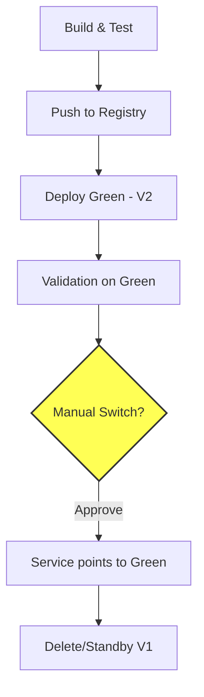

Automatizar o deploy de aplicações Spring Boot exige estratégias que eliminem o downtime e permitam rollbacks instantâneos. Enquanto o Canary foca em tráfego progressivo, o **Blue-Green Deployment** foca em ambientes espelhados: você sobe a nova versão (Green) ao lado da atual (Blue) e alterna o tráfego de uma só vez após a validação.

Neste artigo, vamos construir uma pipeline no **GitLab CI** que utiliza um **Docker Registry** para armazenar imagens imutáveis e o **Helm** para gerenciar a alternância de tráfego no Kubernetes.

> O código completo e os manifestos utilizados nesta simulação estão disponíveis no repositório: [blue-green-deployment-simulation](https://github.com/AugustoSavi/blue-green-deployment-simulation)
{: .prompt-info }

## O Fluxo Blue-Green

Diferente do deploy tradicional, o Blue-Green mantém duas versões da aplicação. O Service do Kubernetes atua como o roteador, apontando para uma das duas.



## 1. O Artefato imutável no Registry

Para que o deploy seja confiável, a imagem deve ser construída uma única vez e armazenada em um registro (como o GitLab Container Registry ou Docker Hub).

### Dockerfile Otimizado
```dockerfile
FROM maven:3.9-eclipse-temurin-21 AS builder
WORKDIR /app
COPY . .
RUN mvn clean package -DskipTests

FROM eclipse-temurin:21-jre-jammy
WORKDIR /app
COPY --from=builder /app/target/*.jar app.jar
ENTRYPOINT ["java", "-jar", "app.jar"]
```

## 2. A Pipeline no GitLab CI (`.gitlab-ci.yml`)

A pipeline agora é configurada para garantir que a imagem chegue ao registro antes de qualquer tentativa de deploy.

### Variáveis e Autenticação
```yaml
variables:
  REGISTRY: index.docker.io/meu-usuario
  IMAGE_NAME: spring-app
  IMAGE_TAG: $CI_COMMIT_SHORT_SHA

before_script:
  - docker login -u $DOCKER_USER -p $DOCKER_PASSWORD
```

### Estágio de Package (Registry)
```yaml
package-image:
  stage: package
  script:
    - docker build -t $REGISTRY/$IMAGE_NAME:$IMAGE_TAG .
    - docker push $REGISTRY/$IMAGE_NAME:$IMAGE_TAG
```

### Estágio Deploy Green (Ambiente Novo)
Nesta fase, instalamos a nova versão sem afetar o tráfego principal. O Helm Chart deve usar um sufixo ou seletor específico.

```yaml
deploy-green:
  stage: deploy
  image: dtzar/helm-kubectl:latest
  script:
    - helm upgrade --install myapp-green ./chart
      --set image.repository=$REGISTRY/$IMAGE_NAME
      --set image.tag=$IMAGE_TAG
      --set replicaCount=2
      --set versionLabel=green
```

### Estágio de Promoção (Switch de Tráfego)
Este é o passo manual. Ao ser executado, o Service principal do Kubernetes é atualizado para apontar para os Pods com a label `versionLabel=green`.

```yaml
promote-to-production:
  stage: promote
  script:
    - helm upgrade myapp-service ./chart-service
      --set activeVersion=green
  when: manual
```

## 3. Simulação Totalmente Local com Registry

Para simular isso localmente com fidelidade à produção, não usaremos o `docker-env` do Minikube. Vamos rodar um **Local Registry**.

### Passo a Passo

1. **Inicie o Registry Local:**
   ```bash
   docker run -d -p 5000:5000 --name local-registry registry:2
   ```

2. **Configure o Minikube para aceitar o Insecure Registry:**
   ```bash
   minikube start --insecure-registry="{{host}}"
   ```

3. **Build e Push (Simulando o GitLab CI):**
   ```bash
   # Build
   docker build -t {{name}}:{{version}} .
   # Push para o registro local (como a pipeline faria)
   docker push {{name}}:{{version}}
   ```

4. **Deploy Blue-Green Manual:**
   Instale a versão Green no cluster:
   ```bash
   helm upgrade --install myapp-green ./chart --set image.repository=localhost:5000/spring-app --set image.tag={{version}}
   ```

## Conclusão

A transição de Canary para **Blue-Green** oferece um controle mais binário e seguro sobre a entrega. Ao centralizar as imagens em um **Docker Registry**, garantimos que o Kubernetes sempre baixe o mesmo artefato validado pela pipeline de CI, evitando a "deriva de configuração" entre máquinas locais e servidores de produção.

{: .prompt-tip }
> **Dica:** Em um cenário de Rollback, basta re-executar o job de switch apontando o seletor de volta para `blue`. A versão antiga ainda estará rodando nos Pods originais até que você decida removê-los.
