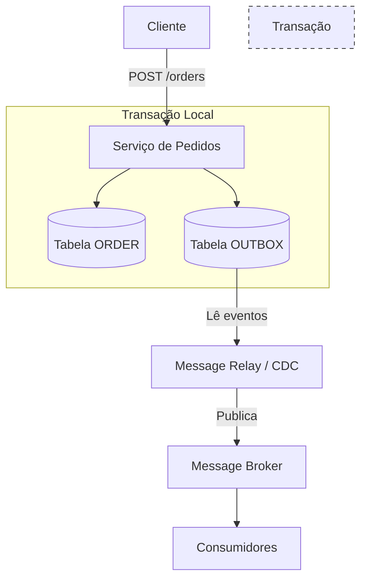

Se você já se viu em uma situação onde o registro foi salvo no banco de dados, mas o evento nunca chegou ao Kafka, ou vice-versa, você encontrou o problema da escrita dupla.

O **Transactional Outbox Pattern** surge como a solução definitiva para esse dilema, utilizando a própria transação do banco de dados relacional para mediar a comunicação entre o mundo dos dados e o mundo dos eventos.

## Cenário

O cenário é comum: um serviço de pedidos precisa salvar um novo `Order` no banco e enviar um evento `OrderCreated` para um Message Broker (como Kafka ou RabbitMQ).

```java
@Transactional
public void createOrder(OrderRequest request) {
    Order order = repository.save(new Order(request)); // Passo 1: DB
    publisher.sendEvent(new OrderCreatedEvent(order)); // Passo 2: Broker
}
```

Nesse modelo simplista, temos dois pontos críticos de falha:
1.  O banco de dados confirma a transação, mas a rede falha antes do evento ser enviado. O sistema fica inconsistente: o pedido existe, mas os serviços downstream (como estoque ou pagamentos) nunca saberão disso.
2.  O evento é enviado, mas a transação do banco sofre um *rollback* (ex: erro de constraint). O sistema fica inconsistente de novo: os serviços downstream agem sobre um pedido que tecnicamente não existe.

## A Anatomia do Outbox Pattern

A essência do padrão é converter o envio de uma mensagem em uma operação de banco de dados. Em vez de enviar o evento diretamente para o broker, nós o escrevemos em uma tabela específica chamada `OUTBOX` dentro da mesma transação de negócio.

Como ambas as operações (salvar o pedido e salvar o evento) estão na mesma transação, garantimos a **Atomicidade**: ou ambos são salvos, ou nenhum é.

### Fluxo de Funcionamento



## Implementação Prática

Vamos visualizar como seria a estrutura de uma entidade de Outbox e o serviço que a utiliza.

### A Entidade Outbox

```java
@Entity
@Table(name = "outbox")
public class OutboxEvent {

    @Id
    @GeneratedValue(strategy = GenerationType.UUID)
    private UUID id;

    @Column(nullable = false)
    private String aggregateId;

    @Column(nullable = false)
    private String aggregateType;

    @Column(nullable = false)
    private String eventType;

    @Column(columnDefinition = "TEXT", nullable = false)
    private String payload;

    @Column(nullable = false)
    private LocalDateTime createdAt;

    // Construtores, Getters e Setters
}
```

### O Serviço de Negócio

Agora, a lógica de negócio se torna puramente focada em persistência.

```java
@Service
@RequiredArgsConstructor
public class OrderService {

    private final OrderRepository orderRepository;
    private final OutboxRepository outboxRepository;
    private final ObjectMapper objectMapper;

    @Transactional
    public void processOrder(OrderRequest request) {
        Order order = new Order(request);
        orderRepository.save(order);

        try {
            String payload = objectMapper.writeValueAsString(order);
            
            OutboxEvent event = new OutboxEvent();
            event.setAggregateId(order.getId().toString());
            event.setAggregateType("ORDER");
            event.setEventType("ORDER_CREATED");
            event.setPayload(payload);
            event.setCreatedAt(LocalDateTime.now());

            outboxRepository.save(event);
        } catch (JsonProcessingException e) {
            throw new RuntimeException("Erro ao serializar evento", e);
        }
    }
}
```

## O Próximo Passo: Message Relay

Ter os dados na tabela `OUTBOX` é apenas metade do caminho. Precisamos de um processo que mova esses dados para o broker. Existem duas estratégias principais:

1.  **Polling Publisher:** Um processo em background consulta a tabela `OUTBOX` periodicamente (ex: a cada 500ms), publica os eventos e os marca como processados ou os deleta. É simples de implementar, mas introduz latência e sobrecarga no banco.
2.  **Transaction Log Tailer (CDC):** Utiliza ferramentas como o **Debezium** para ler o log de transações do banco de dados (como o Binlog do MySQL ou WAL do PostgreSQL). Quando uma nova linha é inserida na tabela `OUTBOX`, o CDC a captura e envia para o Kafka quase em tempo real. Esta é a abordagem de alta performance.

## Dificuldades e Trade-offs

Apesar de resolver o problema da consistência, o Outbox Pattern não é uma "bala de prata".

*   **Entrega At-Least-Once:** O padrão garante que a mensagem será enviada pelo menos uma vez. No entanto, se o Message Relay falhar após enviar a mensagem mas antes de marcar como processada, ela será enviada novamente. **Idempotência nos consumidores é obrigatória.**
*   **Ordenação de Mensagens:** Se você tiver múltiplos Message Relays rodando, a ordem das mensagens pode ser comprometida. É crucial usar chaves de partição (como o `aggregateId`) para garantir que eventos do mesmo objeto cheguem na ordem correta.
*   **Complexidade Operacional:** Se optar por CDC, você terá um componente a mais (ex: Kafka Connect + Debezium) para monitorar e manter.
*   **Limpeza da Tabela:** A tabela `OUTBOX` cresce rapidamente. É necessário implementar uma estratégia de arquivamento ou deleção para não impactar a performance do banco de dados principal.

## Quando utilizar este padrão?

O Outbox Pattern é essencial em sistemas onde a integridade referencial entre serviços é crítica.

*   **Sistemas de Pagamentos:** Onde um "recebido" no banco precisa obrigatoriamente disparar um fluxo de liquidação.
*   **E-commerce:** Para garantir que a reserva de estoque aconteça sempre que um pedido for criado.
*   **Sincronização de Dados:** Quando você precisa manter uma View Materializada ou um índice no ElasticSearch sincronizado com seu banco de dados transacional.

## Resumo

O Transactional Outbox Pattern é uma demonstração clara de como podemos usar ferramentas maduras (bancos de dados relacionais e suas transações ACID) para resolver problemas modernos de escala e distribuição. Ao aceitar a complexidade de gerenciar uma tabela de eventos, ganhamos a tranquilidade de saber que nosso sistema nunca deixará um rastro de dados órfãos ou eventos fantasmagóricos.
