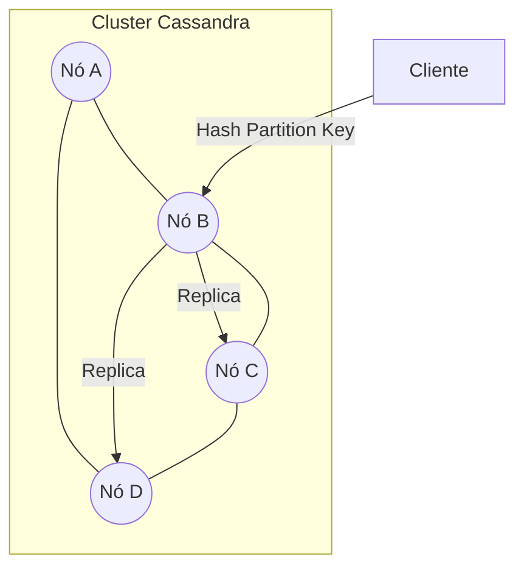
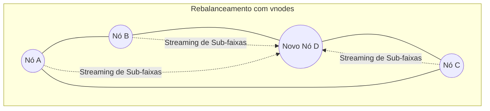

Quando sistemas alcançam a escala de petabytes e milhões de requisições por segundo, a arquitetura tradicional de bancos de dados relacionais (RDBMS) começa a apresentar fissuras. O gargalo geralmente não está na CPU ou na memória, mas na própria natureza centralizada do armazenamento. O Apache Cassandra nasceu para resolver exatamente este cenário: como escalar horizontalmente de forma linear sem nunca sacrificar a disponibilidade.

## O Limite da Centralização

Em bancos de dados relacionais, escalar geralmente significa "comprar um servidor maior" (escala vertical) ou implementar *sharding* manual e complexas topologias de replicação Master-Slave. O problema é que, mesmo com réplicas de leitura, a escrita continua sendo um ponto único de falha ou um gargalo de contenção. Se o Master cai, o sistema entra em modo de recuperação, gerando downtime ou latência.

O Apache Cassandra subverte essa lógica através de uma arquitetura baseada no paper do Amazon Dynamo e no Google BigTable. Ele não possui um "nó mestre". Todos os nós são iguais, o que chamamos de arquitetura *Masterless*. Maiores detalhes podem ser encontrados na [Documentação de Arquitetura Oficial](https://cassandra.apache.org/doc/latest/cassandra/architecture/index.html).

## A Arquitetura em Anel e Particionamento

No Cassandra, os dados são distribuídos em um anel de nós. Cada dado é atribuído a um nó com base em um hash da sua **Partition Key**.



Quando um cliente envia uma escrita, qualquer nó pode atuar como coordenador. Ele calcula para quais nós aquela partição pertence e replica os dados conforme o **Replication Factor** configurado. Isso garante que, mesmo que dois nós morram simultaneamente, os dados ainda estejam disponíveis em outros pontos do anel.

## Vantagens e Desvantagens

A escolha pelo Cassandra nunca é gratuita; ela é baseada no Teorema CAP, onde o Cassandra prioriza **Disponibilidade e Tolerância a Partição (AP)**.

### Vantagens
- **Escalabilidade Linear:** Se você precisa do dobro de throughput, basta dobrar o número de nós.
- **Escrita de Alta Performance:** O Cassandra utiliza uma estrutura de log (LSM Trees) que transforma escritas aleatórias em sequenciais no disco, tornando-o incrivelmente rápido para ingestão de dados.
- **Sem Ponto Único de Falha:** A arquitetura masterless garante que o cluster continue operando enquanto a maioria dos nós estiver saudável.
- **Multi-Data Center:** Suporte nativo para replicação entre diferentes regiões geográficas com latência mínima.

### Desvantagens
- **Sem Joins ou Integridade Referencial:** Esqueça o `JOIN`. Se você precisa relacionar dados, deve fazer isso na camada de aplicação ou desnormalizar.
- **Modelagem Rígida:** Você deve modelar suas tabelas estritamente de acordo com as queries que irá executar. Alterar uma forma de busca muitas vezes exige criar uma nova tabela.
- **Consistência Eventual:** Por padrão, os dados podem demorar alguns milisegundos para estarem idênticos em todos os nós (embora isso seja configurável via *Consistency Levels*).

## Buscas Rápidas: O Segredo da Modelagem

Para obter buscas em milisegundos no Cassandra, você deve evitar a todo custo o *Full Table Scan*. A regra de ouro é: **Uma tabela por query**.

O segredo está na **Primary Key**, que é composta por:
1.  **Partition Key:** Define em qual nó o dado reside.
2.  **Clustering Columns:** Define a ordenação dos dados dentro da partição no disco.

Se você quer buscar as últimas transações de um usuário de forma ultra rápida, sua modelagem deve ser:

```sql
-- scripts/init.cql
CREATE KEYSPACE IF NOT EXISTS wallet_system 
WITH replication = {'class': 'SimpleStrategy', 'replication_factor': 3};

USE wallet_system;

CREATE TABLE IF NOT EXISTS transactions_by_user (
    user_id uuid,
    transaction_id timeuuid,
    amount decimal,
    status text,
    PRIMARY KEY (user_id, transaction_id)
) WITH CLUSTERING ORDER BY (transaction_id DESC);
```

Neste exemplo, todas as transações de um `user_id` específico são armazenadas fisicamente juntas e já ordenadas. A busca se torna um acesso sequencial simples, o que é extremamente eficiente.

## Simulando um Cluster Local com Docker

Para entender o Cassandra, nada melhor do que ver os nós conversando. Vamos criar um ambiente com 3 nós utilizando o [Docker Oficial](https://hub.docker.com/_/cassandra) e Docker Compose, incluindo limites de memória para simular um ambiente mais restrito e uma interface visual para facilitar a consulta.

```yaml
services:
  cassandra-1:
    image: cassandra:latest
    container_name: cassandra-1
    ports:
      - "9042:9042"
    mem_limit: 1g
    environment:
      - CASSANDRA_CLUSTER_NAME=DevCluster
      - CASSANDRA_DC=DC1
      - CASSANDRA_ENDPOINT_SNITCH=GossipingPropertyFileSnitch
      - MAX_HEAP_SIZE=512M
      - HEAP_NEWSIZE=128M
    ulimits:
      memlock:
        soft: -1
        hard: -1
    volumes:
      - cassandra-data-1:/var/lib/cassandra
    healthcheck:
      test: ["CMD-SHELL", "nodetool status | grep UN"]
      interval: 15s
      timeout: 10s
      retries: 10

  cassandra-2:
    image: cassandra:latest
    container_name: cassandra-2
    mem_limit: 1g
    environment:
      - CASSANDRA_CLUSTER_NAME=DevCluster
      - CASSANDRA_DC=DC1
      - CASSANDRA_SEEDS=cassandra-1
      - CASSANDRA_ENDPOINT_SNITCH=GossipingPropertyFileSnitch
      - MAX_HEAP_SIZE=512M
      - HEAP_NEWSIZE=128M
    ulimits:
      memlock:
        soft: -1
        hard: -1
    volumes:
      - cassandra-data-2:/var/lib/cassandra
    depends_on:
      cassandra-1:
        condition: service_healthy

  cassandra-3:
    image: cassandra:latest
    container_name: cassandra-3
    mem_limit: 1g
    environment:
      - CASSANDRA_CLUSTER_NAME=DevCluster
      - CASSANDRA_DC=DC1
      - CASSANDRA_SEEDS=cassandra-1
      - CASSANDRA_ENDPOINT_SNITCH=GossipingPropertyFileSnitch
      - MAX_HEAP_SIZE=512M
      - HEAP_NEWSIZE=128M
    ulimits:
      memlock:
        soft: -1
        hard: -1
    volumes:
      - cassandra-data-3:/var/lib/cassandra
    depends_on:
      - cassandra-2

  cassandra-web:
    image: ipushc/cassandra-web
    container_name: cassandra-web
    restart: always
    ports:
      - "3000:80"
    environment:
      - CASSANDRA_HOST=cassandra-1
      - CASSANDRA_PORT=9042
      - HOST_PORT=:80
    depends_on:
      cassandra-1:
        condition: service_healthy

volumes:
  cassandra-data-1:
  cassandra-data-2:
  cassandra-data-3:
```
{: file="docker-compose.yml" }

### ENVs

- `CASSANDRA_CLUSTER_NAME`: Define o nome lógico do cluster. Apenas nós com o mesmo nome conseguem se comunicar e formar um anel.
- `CASSANDRA_DC`: Define o nome do Datacenter. No Cassandra, o DC é uma divisão lógica usada para replicação inteligente e proximidade de rede.
- `CASSANDRA_ENDPOINT_SNITCH`: O *Snitch* é o componente que ensina ao Cassandra a topologia da rede. O `GossipingPropertyFileSnitch` é o padrão recomendado, pois utiliza o protocolo Gossip para propagar informações de DC e Rack.
- `MAX_HEAP_SIZE` e `HEAP_NEWSIZE`: Configurações críticas da JVM. Em containers, é essencial limitar o Heap para evitar que o processo seja morto pelo OOM Killer do Docker, garantindo que o Cassandra opere dentro dos limites de `mem_limit`.
- `CASSANDRA_SEEDS`: Lista de nós "semente". Quando um novo nó sobe, ele entra em contato com os seeds para descobrir quem são os outros membros do cluster e obter o Token Map atualizado.

### Automação e Massa de Dados

Em sistemas distribuídos, configurar o schema e popular dados manualmente é ineficiente. Podemos automatizar o processo aguardando a saúde do cluster e injetando dados via script Bash.

```bash
#!/bin/bash
# scripts/setup.sh
echo "Aguardando o Cassandra subir..."
until docker exec cassandra-1 cqlsh -e "describe cluster" > /dev/null 2>&1; do
  printf "."
  sleep 5
done

echo -e "\nCluster pronto! Aplicando schema..."
docker exec -i cassandra-1 cqlsh < scripts/init.cql

echo "Gerando dados iniciais..."
./scripts/generate_data.sh | docker exec -i cassandra-1 cqlsh
```
{: file="scripts/setup.sh" }

O uso do `cassandra-web` permite visualizar as transações geradas acessando `http://localhost:3000`. Essa visibilidade é crucial para entender como a **Partition Key** (`user_id`) realmente distribui os dados entre os nós físicos do cluster.

### Validando o Cluster

Após subir o ambiente com `docker-compose up -d`, você pode verificar a saúde do anel utilizando a ferramenta `nodetool`.

```bash
docker exec -it cassandra-1 nodetool status
```

O output esperado deve mostrar os três nós com o status `UN` (Up/Normal):

```text
Datacenter: DC1
===============
Status=Up/Down
|/ State=Normal/Leaving/Joining/Moving
--  Address     Load       Tokens  Owns (effective)  Host ID                               Rack
UN  172.18.0.2  105.24 KiB  256     66.7%             ...-9ce0-f86997787050  rack1
UN  172.18.0.3  105.12 KiB  256     66.7%             ...-8b21-a12b43521321  rack1
UN  172.18.0.4  105.43 KiB  256     66.7%             ...-7c32-b23c54632432  rack1
```

## Elasticidade: Adicionando Nós e Rebalanceamento

Uma das maiores forças do Cassandra é a capacidade de expandir o cluster sem downtime. Diferente de bancos tradicionais onde adicionar um nó exige particionamento manual, no Cassandra esse processo é automatizado através de **vnodes** (Virtual Nodes).

### Consistent Hashing: O Elo entre Partition Key e Nodes

A grande dúvida na expansão é: se a **Partition Key** define o nó onde o dado reside, como o Cassandra não "se perde" ao adicionar novos servidores? 

O segredo está no fato de que a Partition Key **não define o nó diretamente**, mas sim a sua posição lógica no anel. O Cassandra utiliza uma camada de indireção chamada **Consistent Hashing**:

1.  **O Token é Imutável:** Quando um dado é inserido, a Partition Key passa por uma função de hash (Murmur3) que gera um **Token**. Esse valor é fixo e nunca muda para aquela chave.
2.  **O Nó é Dinâmico:** O que muda é a responsabilidade sobre as fatias de tokens. O cluster mantém um **Token Map** (distribuído via Gossip) que diz: "Atualmente, tokens de 0 a 1000 pertencem ao Nó A". 
3.  **Redefinição de Faixas:** Ao adicionar o Nó D, o Token Map é atualizado para que o Nó D assuma, por exemplo, os tokens de 500 a 1000. 

Dessa forma, o dado com `user_id: 123` (que sempre gera o mesmo token) simplesmente "descobre" que seu novo endereço físico é o Nó D. O cliente (driver) recebe essa atualização do Token Map e passa a rotear as requisições para o novo responsável sem precisar re-hashar nada.

### O Processo de Bootstrapping e Coordenção

Quando o `cassandra-4` entra no cluster, ele inicia o **Bootstrapping**:
1.  **Streaming Seletivo:** O novo nó olha para as faixas de tokens que ele agora possui e solicita aos donos antigos apenas os dados que se encaixam naquelas faixas. 
2.  **Escritas em Duplicidade:** Durante o processo de entrada, o nó coordenador do cluster é inteligente o suficiente para enviar escritas tanto para os donos antigos quanto para o novo nó que está entrando (pendente), garantindo que nenhum dado seja perdido durante a transição.
3.  **Finalização:** Uma vez que o streaming termina, o nó muda seu estado para `Normal` e passa a ser o dono oficial daquelas fatias.



### Rebalanceamento e Cleanup

Embora o novo nó já comece a responder por suas novas faixas de dados assim que o bootstrap termina, os nós antigos **ainda mantêm** as cópias dos dados que foram transferidos. O Cassandra não deleta esses dados automaticamente para evitar riscos de perda durante a expansão.

Para finalizar o rebalanceamento e liberar espaço em disco nos nós antigos, você deve executar manualmente:

```bash
nodetool cleanup
```

Este comando percorre os dados locais e remove tudo o que não pertence mais àquele nó de acordo com a nova distribuição do anel. É uma operação intensiva de I/O, por isso recomenda-se executá-la em um nó por vez.

## Como o Cassandra funciona por baixo do capô?

O segredo da velocidade de escrita reside no caminho que o dado percorre, conforme detalhado na [Arquitetura de Motor de Armazenamento](https://cassandra.apache.org/doc/latest/cassandra/architecture/storage_engine.html):
1.  **Commit Log:** O dado é escrito imediatamente em um arquivo de log sequencial no disco (segurança contra quedas).
2.  **Memtable:** O dado é armazenado em uma estrutura na memória (rápido).
3.  **SSTable (Sorted String Table):** Quando a Memtable enche, o Cassandra faz um *flush* dos dados para o disco em um arquivo imutável chamado SSTable.

Como as SSTables são imutáveis, o Cassandra não precisa lidar com locks complexos de atualização. Periodicamente, ele executa um processo chamado **Compaction**, que mescla diferentes SSTables e remove dados antigos ou deletados (marcados com *tombstones*).

## Conclusão

O Apache Cassandra não é um substituto para o MySQL ou PostgreSQL em todos os cenários. Ele é uma arma de precisão para casos onde o volume de escrita e a necessidade de alta disponibilidade superam a necessidade de flexibilidade relacional. Se o seu sistema precisa crescer sem medo de limites de hardware e você pode abraçar a desnormalização, o Cassandra é, sem dúvida, um dos alicerces mais robustos para a sua infraestrutura.

## Referências e Aprofundamento

- [Exemplo Prático: Cassandra Cluster Simulation](https://github.com/AugustoSavi/Cassandra-Cluster-Simulation)
- [Página Oficial do Apache Cassandra](https://cassandra.apache.org/)
- [Documentação Oficial (Latest)](https://cassandra.apache.org/doc/latest/)
- [Guia de Modelagem de Dados](https://cassandra.apache.org/doc/stable/cassandra/developing/data-modeling/index.html)
- [Arquitetura de Motor de Armazenamento (SSTables)](https://cassandra.apache.org/doc/5.0/cassandra/architecture/storage-engine.html#sstables)
- [Imagem Docker Oficial do Cassandra](https://hub.docker.com/_/cassandra)
