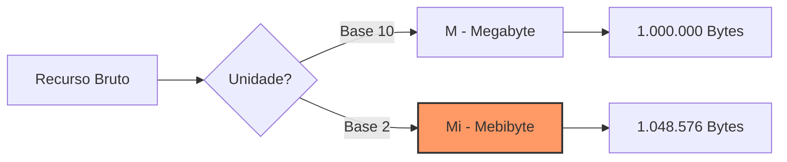

Ao configurar um container no AWS Fargate ou definir os *resources* de um Pod no EKS, é comum nos depararmos com siglas que parecem óbvias, mas escondem detalhes matemáticos cruciais. Ver `500m` de CPU ou `1024Mi` de memória pode gerar confusão: esse `m` é de "Mega"? Esse `Mi` é apenas um jeito de escrever "MB"?

Neste artigo, vamos desmistificar as unidades de medida utilizadas nos principais serviços de Cloud e orquestradores, garantindo que você nunca mais erre o cálculo de capacidade do seu cluster.

## O Enigma do "m": Milli-cores de CPU

Diferente da memória, que é um recurso estático e endereçável, a CPU é medida em tempo de processamento. Nas nuvens modernas (e especialmente no Kubernetes/EKS), a unidade padrão é o **vCPU** (Virtual CPU). No entanto, raramente alocamos CPUs inteiras para microserviços pequenos. É aqui que entra o `m`.

Conforme a [documentação oficial do Kubernetes](https://kubernetes.io/docs/concepts/configuration/manage-resources-containers/#meaning-of-cpu), o `m` significa **milli**, o mesmo prefixo do sistema métrico para "milésimo" (como em milímetro).

- **1 vCPU** = `1000m` (mil millicores)
- **0.5 vCPU** = `500m`
- **0.1 vCPU** = `100m`

### O Limite da Centralização

Se você define um limite de `250m` para sua aplicação Java, está dizendo ao kernel (via Cgroups) que aquele container pode utilizar, no máximo, 25% do tempo de processamento de um núcleo de CPU. 

```yaml
resources:
  requests:
    cpu: "250m" # Equivalente a 1/4 de vCPU
  limits:
    cpu: "500m" # Equivalente a 1/2 vCPU
```

> **Atenção:** No AWS Fargate (fora do EKS), a configuração utiliza números inteiros (ex: 256, 512, 1024) que representam "CPU Units". Nese caso, `1024 units` equivalem a `1 vCPU`. Você pode conferir os valores permitidos na [documentação de Task Definition da AWS](https://docs.aws.amazon.com/AmazonECS/latest/developerguide/task_definition_parameters.html#task_size).
{: .prompt-warning }

## Mi vs M: A Batalha entre Binário e Decimal

Aqui reside o erro mais comum em incidentes de **Out of Memory (OOM)**. A confusão entre o Sistema Internacional (SI) e as unidades binárias (IEC).

### Megabyte (M ou MB) - Base 10
Baseado em potências de 10, é o padrão utilizado por fabricantes de discos rígidos e marketing.
- **1 KB** = 1.000 Bytes
- **1 MB** = 1.000.000 Bytes ($10^6$)

### Mebibyte (Mi ou MiB) - Base 2
Baseado em potências de 2, é como o sistema operacional e a memória RAM realmente funcionam internamente.
- **1 KiB** = 1.024 Bytes
- **1 MiB** = 1.048.576 Bytes ($2^{20}$)

### Por que isso importa?

A diferença parece pequena, mas ela escala. Ao falar de Gigabytes vs Gibibytes, a discrepância é de aproximadamente 7%. Se você reserva `1G` (decimal) achando que tem `1Gi` (binário), sua aplicação pode sofrer um Kill do orquestrador antes do esperado.



## Resumo das Unidades em Cloud

Para facilitar a consulta rápida, utilize estas referências ao configurar seus manifestos e alarmes:

- **CPU (`m`)**: Sempre em milésimos de vCPU.
- **Memória (`Mi`, `Gi`)**: Unidades binárias (1024-based). Recomendado para limites de container.
- **Memória (`M`, `G`)**: Unidades decimais (1000-based). Menos comum em orquestradores, mas presente em métricas de tráfego de rede.

## Aplicação Prática no CloudWatch

Ao analisar gráficos no **AWS CloudWatch**, a unidade costuma ser explícita (Bytes, Megabytes). No entanto, ao criar **CloudWatch Metrics Insights**, você pode se deparar com a necessidade de converter valores.

Se você estiver monitorando o uso de memória de um nó do EKS, o valor retornado estará em Bytes. Para converter para `MiB` em uma fórmula de métrica, você deve dividir por `1048576`, e não por `1000000`.

### Exemplo de Cálculo em Alarmes
Para um alarme que deve disparar em 1GiB:
- **Errado:** `Threshold: 1000000000` (Isso é 1GB decimal)
- **Correto:** `Threshold: 1073741824` (Isso é 1GiB binário)

## Conclusão

Entender a diferença entre `m`, `Mi` e `M` não é apenas preciosismo matemático; é uma necessidade de sobrevivência em ambientes de alta densidade de containers. Configurar limites usando a base errada pode resultar em desperdício de dinheiro (over-provisioning) ou instabilidade sistêmica (throttling e OOMKills).

## Referências

- [Kubernetes: Resource Management for Pods and Containers](https://kubernetes.io/docs/concepts/configuration/manage-resources-containers/)
- [AWS: Amazon ECS Task Definition Parameters (CPU and Memory)](https://docs.aws.amazon.com/AmazonECS/latest/developerguide/task_definition_parameters.html#task_size)
- [CloudWatch: Statistics definitions and units](https://docs.aws.amazon.com/AmazonCloudWatch/latest/monitoring/Statistics-definitions.html)

{: .prompt-tip }
**Dica Final:** Sempre que possível, padronize seus manifestos Kubernetes e definições de tarefas ECS usando as unidades binárias (`Ki`, `Mi`, `Gi`). Elas refletem com precisão como o Linux gerencia as páginas de memória, evitando surpresas durante picos de carga.
