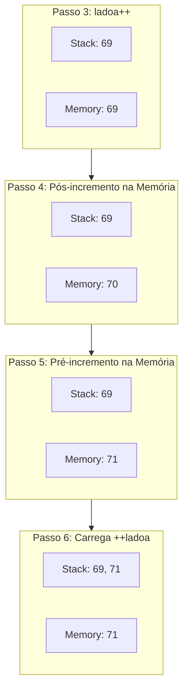

Estou iniciando uma nova jornada que é (tentar 🙂) tirar uma certificação Java. 

Este post marca o início de uma série onde vou estar gerando conteudo com as coisas que acho legal trazer sobre o processo...

Para começar, vamos analisar uma expressão que já vi em alguns simulados: `ladoa++ == ++ladoa`. Se você olhar rápido, pode pensar que, como ambos incrementam a mesma variável, o resultado deveria ser `true`, mas não é o que ocorre... 

## O que ocorre

O segredo não está apenas no valor final da variável, mas em **quando** o valor é entregue para a expressão que o utiliza.

```java
class ComparacaoIncrement {
    void main() {
        int ladoa = 69;
        IO.println(ladoa++ == ++ladoa); // false
        IO.println(ladoa); // 71
    }
}
```
{: file="ComparacaoIncrement.java" }

A execução resulta em `false` e o valor final de `ladoa` é `71`. Para entender o porquê, precisamos olhar a sequência exata de operações na **Pilha de Operandos (Operand Stack)**.

### Passo a Passo no Bytecode

Para ver bytecode estou usando: 

```bash
javac ComparacaoIncrement.java && javap -c -v ComparacaoIncrement > ComparacaoIncrement.bytecode
```

Isso mostra:

- Constant Pool
- Stack size
- Local variables
- Métodos detalhados


Aqui está o bytecode detalhado do método `main`:

```java
  void main();
    Code:
       0: bipush        69        // 1. Coloca 69 na Stack
       2: istore_1                // 2. Armazena na variável local 1 (ladoa = 69)
       3: iload_1                 // 3. Carrega o valor ATUAL (69) na Stack (para o lado esquerdo do ==)
       4: iinc          1, 1      // 4. Incrementa ladoa na memória (ladoa agora é 70)
       7: iinc          1, 1      // 5. Incrementa ladoa na memória novamente (ladoa agora é 71)
      10: iload_1                 // 6. Carrega o valor ATUAL (71) na Stack (para o lado direito do ==)
      11: if_icmpne     18        // 7. Compara os valores no topo da Stack: 69 == 71?
```
{: file="ComparacaoIncrement.bytecode" }

A instrução `iinc` é única porque ela modifica a variável local diretamente na memória **sem passar pela pilha de operandos**. Isso cria o cenário onde o valor "antigo" já está na pilha esperando a comparação, enquanto a memória já foi atualizada.

### Visualizando a Pilha

O diagrama abaixo ilustra o estado da Stack e da Memória (Variáveis Locais) durante a execução da linha crítica:



O resultado é `false` porque o Java avalia expressões da esquerda para a direita. 

1.  O `ladoa++` avalia para `69` e coloca isso na pilha.
2.  Como efeito colateral, `ladoa` vira `70`.
3.  Em seguida, o `++ladoa` incrementa `ladoa` para `71` e coloca `71` na pilha.
4.  A comparação final é `69 == 71`.

> Lembre-se que o operador de igualdade `==` não é um ponto de sincronização. Ele apenas compara os valores que já foram resolvidos e colocados na pilha de operandos seguindo a precedência e a ordem de avaliação (esquerda para a direita).
{: .prompt-tip }

Entender o bytecode não serve apenas para passar em provas, mas para compreender como o código que escrevemos é realmente interpretado pela máquina que o executa.


## Referencias

- [javainuse](https://www.javainuse.com/quiz/1z08291)


## Enviroment

```bash
$ java -version
openjdk version "25.0.2" 2026-01-20
OpenJDK Runtime Environment (build 25.0.2+10-Ubuntu-124.04)
OpenJDK 64-Bit Server VM (build 25.0.2+10-Ubuntu-124.04, mixed mode, sharing)
```