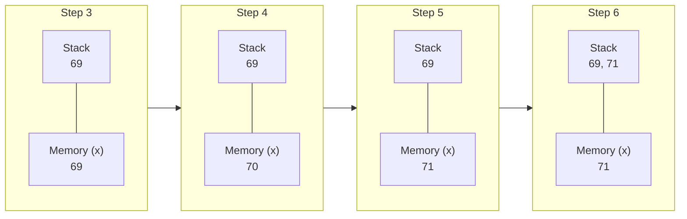

Estou com uma nova meta: tentar 🙂 conquistar a certificação Java 25 (que ainda nem foi lançada — sim, isso mesmo).

Normalmente, a Oracle leva cerca de 1 ano para disponibilizar a certificação após o lançamento oficial da versão. O Java 25, por exemplo, foi lançado em 16 de setembro de 2025.

Então este é o primeiro post de uma série onde vou compartilhar o que estou acho legal sobre o que estou aprendendo ao longo do caminho.

Para começar, vamos analisar uma pergunta que já vi em alguns simulados: `x++ == ++x` é `true` ou `false`?. Se você olhar rápido, pode pensar que, como ambos incrementam a mesma variável, o resultado deveria ser `true`, mas não é o que ocorre :) ... 

## Ordem da Avaliação da Expressão

O comportamento não depende apenas do valor final da variável, mas do momento em que esse valor é fornecido à expressão.

```java
class ComparacaoIncrement {
    void main() {
        int x = 69;
        IO.println(x++ == ++x); // false
        IO.println(x); // 71
    }
}
```
{: file="ComparacaoIncrement.java" }

A execução resulta em `false` e o valor final de `x` é `71`. Para entender o porquê, vamos olhar na **Pilha de Operandos (Operand Stack)**.

### Vamos extrair o bytecode


```bash
javac ComparacaoIncrement.java && javap -c -v ComparacaoIncrement > ComparacaoIncrement.bytecode
```


compilamos e extraimos o bytecode com `javap` que vem com o jdk:

- Bytecode (-c): Desmonta o código, exibindo as instruções bytecode reais.
- Verboso (-v): Exibe informações detalhadas, incluindo tamanho da pilha e constantes.


Aqui está o bytecode detalhado do método `main`:

```java
  void main();
    Code:
       0: bipush        69        // 1. Coloca 69 na Stack
       2: istore_1                // 2. Armazena na variável local 1 (x = 69)
       3: iload_1                 // 3. Carrega o valor ATUAL (69) na Stack (para o lado esquerdo do ==)
       4: iinc          1, 1      // 4. Incrementa x na memória (x agora é 70)
       7: iinc          1, 1      // 5. Incrementa x na memória novamente (x agora é 71)
      10: iload_1                 // 6. Carrega o valor ATUAL (71) na Stack (para o lado direito do ==)
      11: if_icmpne     18        // 7. Compara os valores no topo da Stack: 69 == 71?
```
{: file="ComparacaoIncrement.bytecode" }

A instrução `iinc` é única porque ela modifica a variável local diretamente na memória **sem passar pela pilha de operandos**. Isso cria o cenário onde o valor "antigo" já está na pilha esperando a comparação, enquanto a memória já foi atualizada.

### Visualizando a Pilha

O diagrama abaixo ilustra o estado da Stack e da Memória (Variáveis Locais) durante a execução da linha crítica:



O resultado é `false` porque o Java faz o evaluate das expressões da esquerda para a direita. 

1.  O `x++` é colocado na pilha com `69`
2.  Como depois aplica o 1 com isso `x` vira `70`.
3.  Em seguida, o `++x` incrementa `x` para `71` e coloca `71` na pilha.
4.  A comparação final é `69 == 71`.

> O operador de igualdade `==` não é um ponto de sincronização, ele apenas compara os valores que já foram resolvidos e colocados na pilha de operandos seguindo a precedência e a ordem de avaliação (esquerda para a direita).
{: .prompt-tip }

Você não precisa entender todo o bytecode ou avaliá-lo a cada nova versão do seu software, mas pelo menos saber que é possível avaliá-lo caso queira entender algum comportamento estranho...


## Referencias

- [javainuse](https://www.javainuse.com/quiz/1z08291)


## Enviroment

```bash
$ java -version
openjdk version "25.0.2" 2026-01-20
OpenJDK Runtime Environment (build 25.0.2+10-Ubuntu-124.04)
OpenJDK 64-Bit Server VM (build 25.0.2+10-Ubuntu-124.04, mixed mode, sharing)
```
